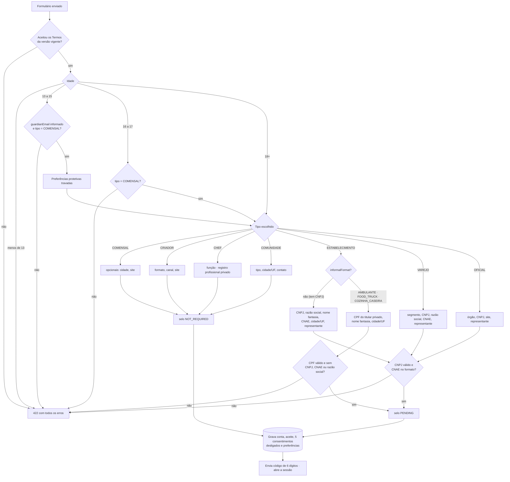

# RF1 · Atividades: regras por tipo de conta

```mermaid
flowchart TD
    A[Formulário enviado] --> T{Aceitou os Termos<br/>da versão vigente?}
    T -- não --> E[422 com todos os erros]
    T -- sim --> I{Idade}
    I -- "menos de 13" --> E
    I -- "13 a 15" --> G{guardianEmail informado<br/>e tipo = COMENSAL?}
    G -- não --> E
    G -- sim --> P[Preferências protetivas travadas]
    I -- "16 a 17" --> C{tipo = COMENSAL?}
    C -- não --> E
    C -- sim --> K
    I -- "18+" --> K
    P --> K{Tipo escolhido}
    K -- COMENSAL --> K1[opcionais: cidade, site]
    K -- CRIADOR --> K2[formato, canal, site]
    K -- CHEF --> K3[função · registro profissional privado]
    K -- COMUNIDADE --> K4[tipo, cidade/UF, contato]
    K -- ESTABELECIMENTO --> IF{informalFormat?}
    IF -- "não (tem CNPJ)" --> K5[CNPJ, razão social, nome fantasia,<br/>CNAE, cidade/UF, representante]
    IF -- "AMBULANTE · FOOD_TRUCK ·<br/>COZINHA_CASEIRA" --> K8[CPF do titular privado,<br/>nome fantasia, cidade/UF]
    K8 --> CPF{CPF válido e sem<br/>CNPJ, CNAE ou razão social?}
    CPF -- não --> E
    CPF -- sim --> S2
    K -- VAREJO --> K6[segmento, CNPJ, razão social, CNAE, representante]
    K -- OFICIAL --> K7[órgão, CNPJ, site, representante]
    K1 & K2 & K3 & K4 --> S1[selo NOT_REQUIRED]
    K5 & K6 & K7 --> V{CNPJ válido e<br/>CNAE no formato?}
    V -- não --> E
    V -- sim --> S2[selo PENDING]
    S1 & S2 --> OK[(Grava conta, aceite, 5 consentimentos<br/>desligados e preferências)]
    OK --> COD[Envia código de 6 dígitos · abre a sessão]
```
