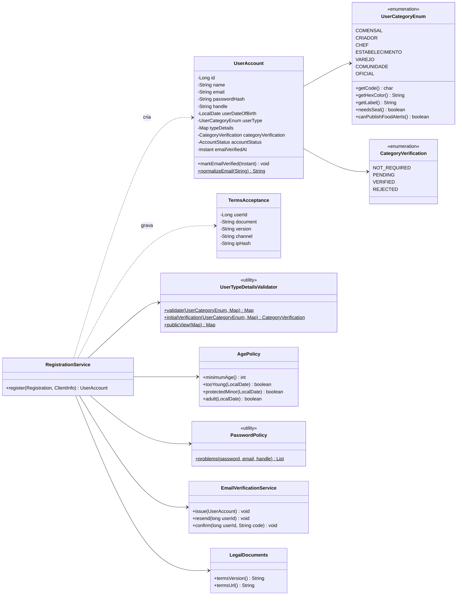

# RF1 · Classes

```mermaid
classDiagram
    direction LR
    class UserAccount {
        -Long id
        -String name
        -String email
        -String passwordHash
        -String handle
        -LocalDate userDateOfBirth
        -UserCategoryEnum userType
        -Map typeDetails
        -CategoryVerification categoryVerification
        -AccountStatus accountStatus
        -Instant emailVerifiedAt
        +markEmailVerified(Instant) void
        +normalizeEmail(String)$ String
    }
    class UserCategoryEnum {
        <<enumeration>>
        COMENSAL
        CRIADOR
        CHEF
        ESTABELECIMENTO
        VAREJO
        COMUNIDADE
        OFICIAL
        +getCode() char
        +getHexColor() String
        +getLabel() String
        +needsSeal() boolean
        +canPublishFoodAlerts() boolean
    }
    class CategoryVerification {
        <<enumeration>>
        NOT_REQUIRED
        PENDING
        VERIFIED
        REJECTED
    }
    class TermsAcceptance {
        -Long userId
        -String document
        -String version
        -String channel
        -String ipHash
    }
    class RegistrationService {
        +register(Registration, ClientInfo) UserAccount
    }
    class UserTypeDetailsValidator {
        <<utility>>
        +validate(UserCategoryEnum, Map)$ Map
        +initialVerification(UserCategoryEnum, Map)$ CategoryVerification
        +publicView(Map)$ Map
    }
    class AgePolicy {
        +minimumAge() int
        +tooYoung(LocalDate) boolean
        +protectedMinor(LocalDate) boolean
        +adult(LocalDate) boolean
    }
    class PasswordPolicy {
        <<utility>>
        +problems(password, email, handle)$ List
    }
    class EmailVerificationService {
        +issue(UserAccount) void
        +resend(long userId) void
        +confirm(long userId, String code) void
    }
    class LegalDocuments {
        +termsVersion() String
        +termsUrl() String
    }
    RegistrationService --> UserTypeDetailsValidator
    RegistrationService --> AgePolicy
    RegistrationService --> PasswordPolicy
    RegistrationService --> LegalDocuments
    RegistrationService --> EmailVerificationService
    RegistrationService ..> UserAccount : cria
    RegistrationService ..> TermsAcceptance : grava
    UserAccount --> UserCategoryEnum
    UserAccount --> CategoryVerification
```
