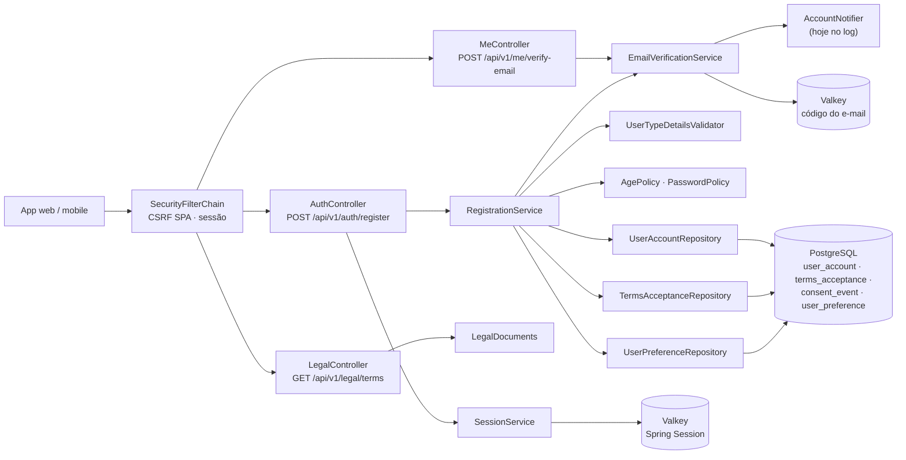

# RF1 · Componentes

```mermaid
flowchart LR
    APP["App web / mobile"] --> SEC["SecurityFilterChain<br/>CSRF SPA · sessão"]
    SEC --> AC["AuthController<br/>POST /api/v1/auth/register"]
    SEC --> LC["LegalController<br/>GET /api/v1/legal/terms"]
    SEC --> MC["MeController<br/>POST /api/v1/me/verify-email"]
    AC --> RS["RegistrationService"]
    LC --> LD["LegalDocuments"]
    MC --> EV["EmailVerificationService"]
    RS --> TV["UserTypeDetailsValidator"]
    RS --> AP["AgePolicy · PasswordPolicy"]
    RS --> EV
    RS --> UR["UserAccountRepository"]
    RS --> TR["TermsAcceptanceRepository"]
    RS --> PR["UserPreferenceRepository"]
    EV --> NT["AccountNotifier<br/>(hoje no log)"]
    EV --> VK[("Valkey<br/>código do e-mail")]
    UR & TR & PR --> PG[("PostgreSQL<br/>user_account · terms_acceptance ·<br/>consent_event · user_preference")]
    AC --> SS["SessionService"] --> VK2[("Valkey<br/>Spring Session")]
```
