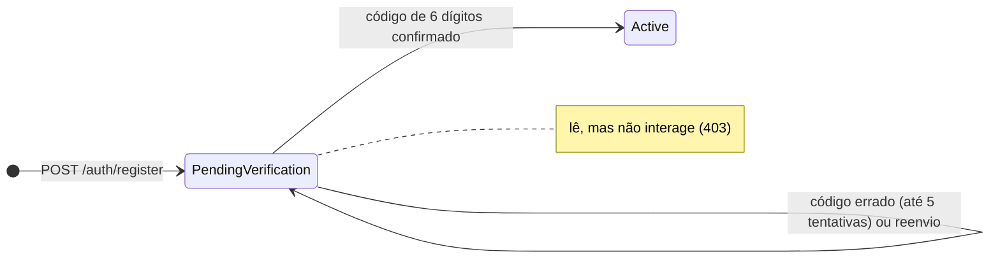
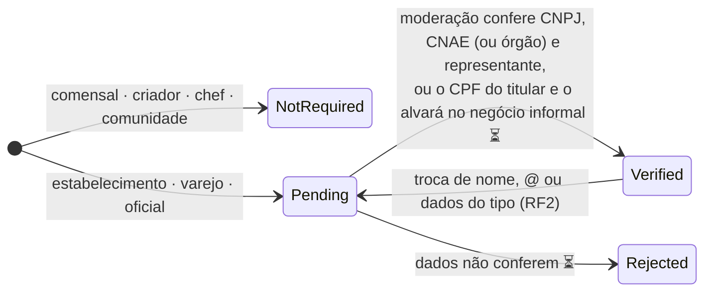

# RF1 · Estados

## Conta no cadastro

```mermaid
stateDiagram-v2
    direction LR
    [*] --> PendingVerification : POST /auth/register
    PendingVerification --> Active : código de 6 dígitos confirmado
    PendingVerification --> PendingVerification : código errado (até 5 tentativas) ou reenvio
    note right of PendingVerification
        lê, mas não interage (403)
    end note
```

## Selo do tipo de conta

```mermaid
stateDiagram-v2
    direction LR
    [*] --> NotRequired : comensal · criador · chef · comunidade
    [*] --> Pending : estabelecimento · varejo · oficial
    Pending --> Verified : moderação confere CNPJ, CNAE (ou órgão) e representante,<br/>ou o CPF do titular e o alvará no negócio informal ⏳
    Pending --> Rejected : dados não conferem ⏳
    Verified --> Pending : troca de nome, @ ou dados do tipo (RF2)
```

O ciclo completo da conta (suspensão, exclusão e eliminação) fica no [RF5](../RF5/estados.md).
