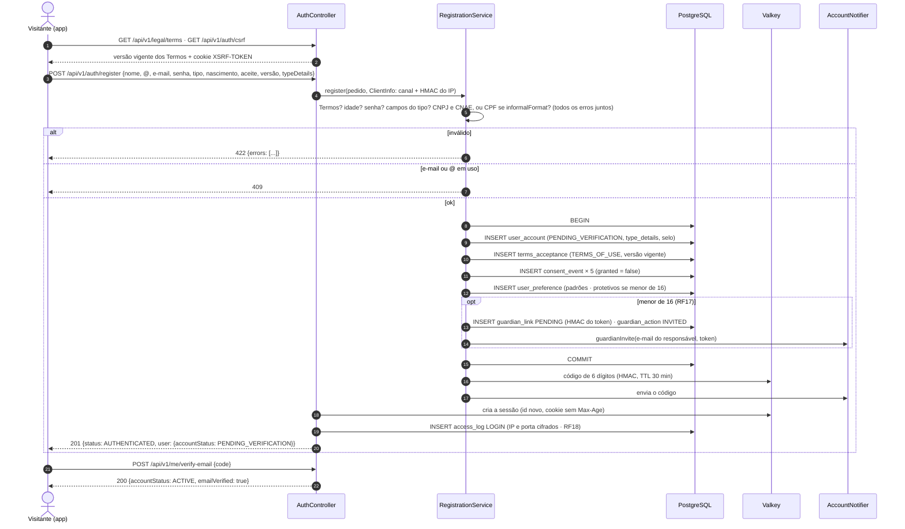

# RF1 · Sequência

```mermaid
sequenceDiagram
    autonumber
    actor V as Visitante (app)
    participant API as AuthController
    participant R as RegistrationService
    participant DB as PostgreSQL
    participant VK as Valkey
    participant N as AccountNotifier

    V->>API: GET /api/v1/legal/terms · GET /api/v1/auth/csrf
    API-->>V: versão vigente dos Termos + cookie XSRF-TOKEN
    V->>API: POST /api/v1/auth/register {nome, @, e-mail, senha, tipo, nascimento, aceite, versão, typeDetails}
    API->>R: register(pedido, ClientInfo: canal + HMAC do IP)
    R->>R: Termos? idade? senha? campos do tipo? CNPJ e CNAE, ou CPF se informalFormat? (todos os erros juntos)
    alt inválido
        R-->>V: 422 {errors: [...]}
    else e-mail ou @ em uso
        R-->>V: 409
    else ok
        R->>DB: BEGIN
        R->>DB: INSERT user_account (PENDING_VERIFICATION, type_details, selo)
        R->>DB: INSERT terms_acceptance (TERMS_OF_USE, versão vigente)
        R->>DB: INSERT consent_event × 5 (granted = false)
        R->>DB: INSERT user_preference (padrões · protetivos se menor de 16)
        opt menor de 16 (RF17)
            R->>DB: INSERT guardian_link PENDING (HMAC do token) · guardian_action INVITED
            R->>N: guardianInvite(e-mail do responsável, token)
        end
        R->>DB: COMMIT
        R->>VK: código de 6 dígitos (HMAC, TTL 30 min)
        R->>N: envia o código
        API->>VK: cria a sessão (id novo, cookie sem Max-Age)
        API->>DB: INSERT access_log LOGIN (IP e porta cifrados · RF18)
        API-->>V: 201 {status: AUTHENTICATED, user: {accountStatus: PENDING_VERIFICATION}}
    end
    V->>API: POST /api/v1/me/verify-email {code}
    API-->>V: 200 {accountStatus: ACTIVE, emailVerified: true}
```
