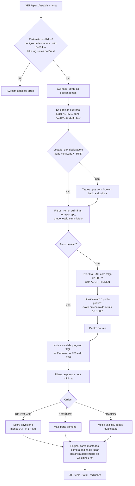

# RF10 · Atividades

```mermaid
flowchart TD
    A[GET /api/v1/establishments] --> V{Parâmetros válidos?<br/>códigos da taxonomia, raio 0–50 km,<br/>lat e lng juntas no Brasil}
    V -- não --> E[422 com todos os erros]
    V -- sim --> X[Culinária: soma as descendentes]
    X --> P[Só páginas públicas:<br/>lugar ACTIVE, dono ACTIVE e VERIFIED]
    P --> AD{Logado, 18+ declarado e<br/>idade verificada? · RF17}
    AD -- não --> NA[Tira os tipos com foco em bebida alcoólica]
    AD -- sim --> F
    NA --> F[Filtros: nome, culinária, formato, tipo,<br/>grupo, estilo e município]
    F --> G{Perto de mim?}
    G -- sim --> R[Pré-filtro GiST com folga de 600 m<br/>sem ADDR_HIDDEN]
    R --> D[Distância até o ponto público:<br/>exato ou centro da célula de 0,005°]
    D --> RAIO[Dentro do raio]
    G -- não --> AGG
    RAIO --> AGG[Nota e nível de preço no SQL:<br/>as fórmulas do RF8 e do RF6]
    AGG --> PF[Filtros de preço e nota mínima]
    PF --> O{Ordem}
    O -- RELEVANCE --> O1[Score bayesiano<br/>menos 0,3 · ln 1 + km]
    O -- DISTANCE --> O2[Mais perto primeiro]
    O -- RATING --> O3[Média exibida, depois quantidade]
    O1 & O2 & O3 --> C[Página: cards montados como a página do lugar<br/>distância aproximada de 0,5 em 0,5 km]
    C --> OK[200 items · total · radiusKm]
```
