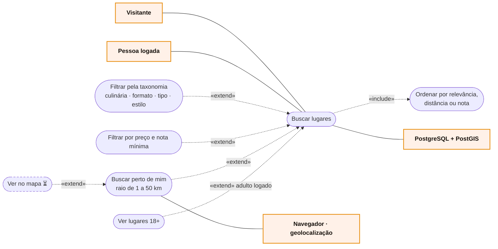

# RF10 · Casos de uso

Atores primários à esquerda, secundários à direita.

```mermaid
flowchart LR
    V["Visitante"]:::actor
    P["Pessoa logada"]:::actor

    UC1(["Buscar lugares"])
    UC2(["Filtrar pela taxonomia<br/>culinária · formato · tipo · estilo"])
    UC3(["Filtrar por preço e nota mínima"])
    UC4(["Buscar perto de mim<br/>raio de 1 a 50 km"])
    UC5(["Ordenar por relevância,<br/>distância ou nota"])
    UC6(["Ver lugares 18+"])
    UC7(["Ver no mapa ⏳"]):::planned

    GEO["Navegador · geolocalização"]:::actor
    PG["PostgreSQL + PostGIS"]:::actor

    V --- UC1
    P --- UC1
    UC1 -. «include» .-> UC5
    UC2 -. «extend» .-> UC1
    UC3 -. «extend» .-> UC1
    UC4 -. «extend» .-> UC1
    UC6 -. «extend» adulto logado .-> UC1
    UC7 -. «extend» .-> UC4
    UC4 --- GEO
    UC1 --- PG

    classDef actor fill:#FFF1E8,stroke:#E88F12,stroke-width:2px,color:#17120D,font-weight:bold
    classDef planned stroke-dasharray:5 4
```
