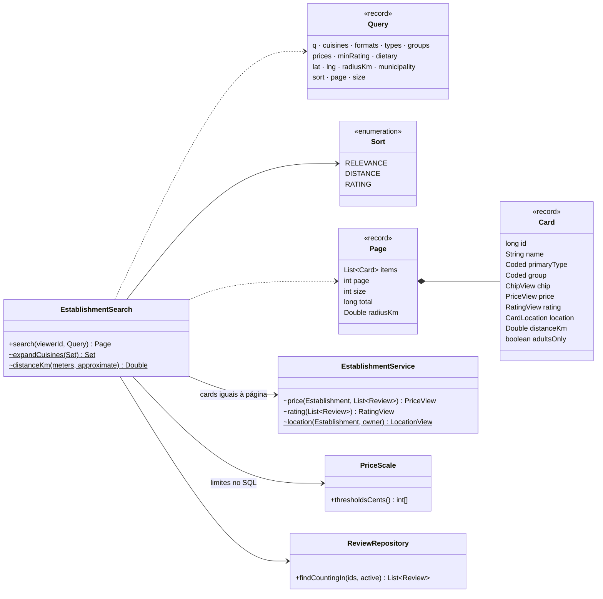

# RF10 · Classes

```mermaid
classDiagram
    direction LR
    class EstablishmentSearch {
        +search(viewerId, Query) Page
        ~expandCuisines(Set)$ Set
        ~distanceKm(meters, approximate)$ Double
    }
    class Query {
        <<record>>
        q · cuisines · formats · types · groups
        prices · minRating · dietary
        lat · lng · radiusKm · municipality
        sort · page · size
    }
    class Sort {
        <<enumeration>>
        RELEVANCE
        DISTANCE
        RATING
    }
    class Page {
        <<record>>
        List~Card~ items
        int page
        int size
        long total
        Double radiusKm
    }
    class Card {
        <<record>>
        long id
        String name
        Coded primaryType
        Coded group
        ChipView chip
        PriceView price
        RatingView rating
        CardLocation location
        Double distanceKm
        boolean adultsOnly
    }
    class EstablishmentService {
        ~price(Establishment, List~Review~) PriceView
        ~rating(List~Review~) RatingView
        ~location(Establishment, owner)$ LocationView
    }
    class PriceScale {
        +thresholdsCents() int[]
    }
    class ReviewRepository {
        +findCountingIn(ids, active) List~Review~
    }
    EstablishmentSearch ..> Query
    EstablishmentSearch ..> Page
    Page *-- Card
    EstablishmentSearch --> Sort
    EstablishmentSearch --> EstablishmentService : cards iguais à página
    EstablishmentSearch --> PriceScale : limites no SQL
    EstablishmentSearch --> ReviewRepository
```
