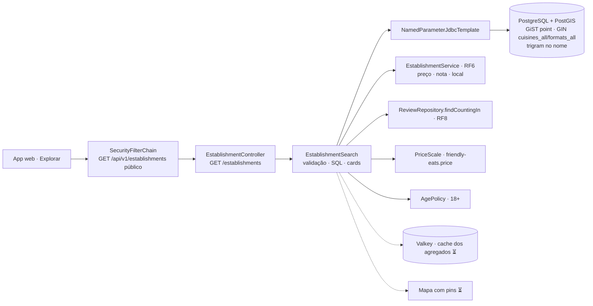

# RF10 · Componentes

```mermaid
flowchart LR
    APP["App web · Explorar"] --> SEC["SecurityFilterChain<br/>GET /api/v1/establishments público"]
    SEC --> EC["EstablishmentController<br/>GET /establishments"]
    EC --> ES["EstablishmentSearch<br/>validação · SQL · cards"]
    ES --> NJ["NamedParameterJdbcTemplate"]
    NJ --> PG[("PostgreSQL + PostGIS<br/>GiST point · GIN cuisines_all/formats_all<br/>trigram no nome")]
    ES --> SVC["EstablishmentService · RF6<br/>preço · nota · local"]
    ES --> RR["ReviewRepository.findCountingIn · RF8"]
    ES --> PS["PriceScale · friendly-eats.price"]
    ES --> AP["AgePolicy · 18+"]
    ES -.-> VK[("Valkey · cache dos agregados ⏳")]
    ES -.-> MAP["Mapa com pins ⏳"]
```
