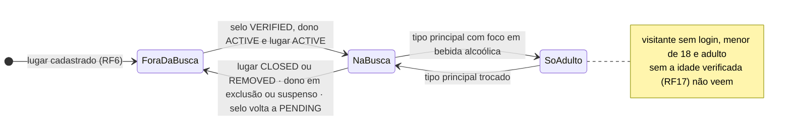
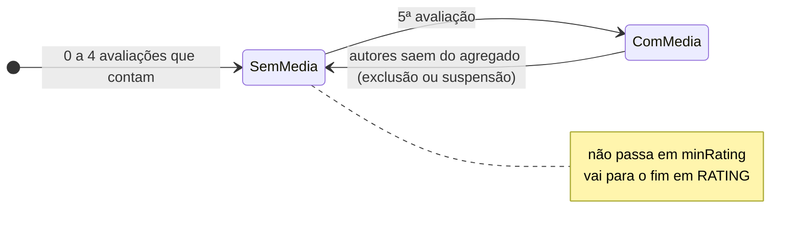

# RF10 · Estados

A busca não muda dados. O que muda é **se um lugar aparece** para quem busca:

```mermaid
stateDiagram-v2
    direction LR
    [*] --> ForaDaBusca : lugar cadastrado (RF6)
    ForaDaBusca --> NaBusca : selo VERIFIED, dono ACTIVE e lugar ACTIVE
    NaBusca --> ForaDaBusca : lugar CLOSED ou REMOVED · dono em exclusão ou suspenso · selo volta a PENDING
    NaBusca --> SoAdulto : tipo principal com foco em bebida alcoólica
    SoAdulto --> NaBusca : tipo principal trocado
    note right of SoAdulto
        visitante sem login, menor de 18 e adulto
        sem a idade verificada (RF17) não veem
    end note
```

## Nota usada no filtro e na ordem

```mermaid
stateDiagram-v2
    direction LR
    [*] --> SemMedia : 0 a 4 avaliações que contam
    SemMedia --> ComMedia : 5ª avaliação
    ComMedia --> SemMedia : autores saem do agregado (exclusão ou suspensão)
    note right of SemMedia
        não passa em minRating
        vai para o fim em RATING
    end note
```
