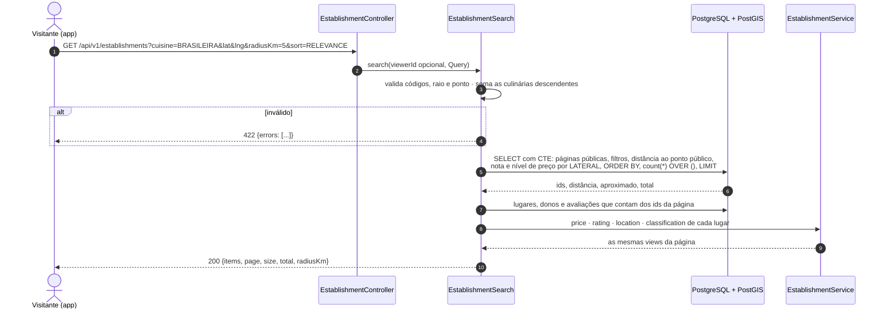

# RF10 · Sequência

```mermaid
sequenceDiagram
    autonumber
    actor V as Visitante (app)
    participant API as EstablishmentController
    participant S as EstablishmentSearch
    participant DB as PostgreSQL + PostGIS
    participant P as EstablishmentService

    V->>API: GET /api/v1/establishments?cuisine=BRASILEIRA&lat&lng&radiusKm=5&sort=RELEVANCE
    API->>S: search(viewerId opcional, Query)
    S->>S: valida códigos, raio e ponto · soma as culinárias descendentes
    alt inválido
        S-->>V: 422 {errors: [...]}
    end
    S->>DB: SELECT com CTE: páginas públicas, filtros, distância ao ponto público,<br/>nota e nível de preço por LATERAL, ORDER BY, count(*) OVER (), LIMIT
    DB-->>S: ids, distância, aproximado, total
    S->>DB: lugares, donos e avaliações que contam dos ids da página
    S->>P: price · rating · location · classification de cada lugar
    P-->>S: as mesmas views da página
    S-->>V: 200 {items, page, size, total, radiusKm}
```
