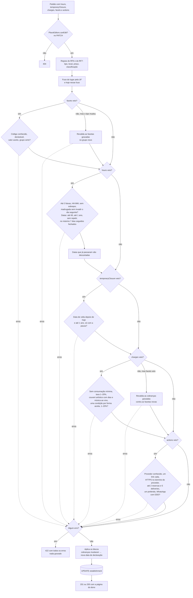
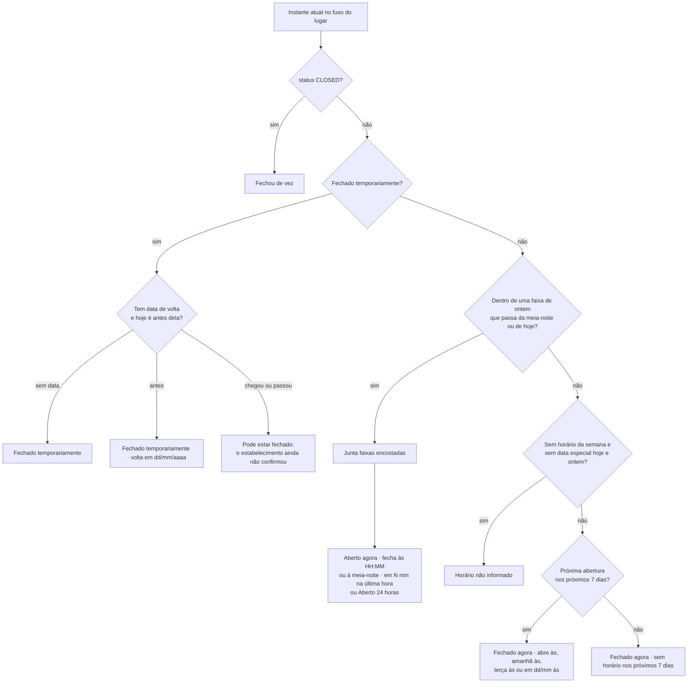
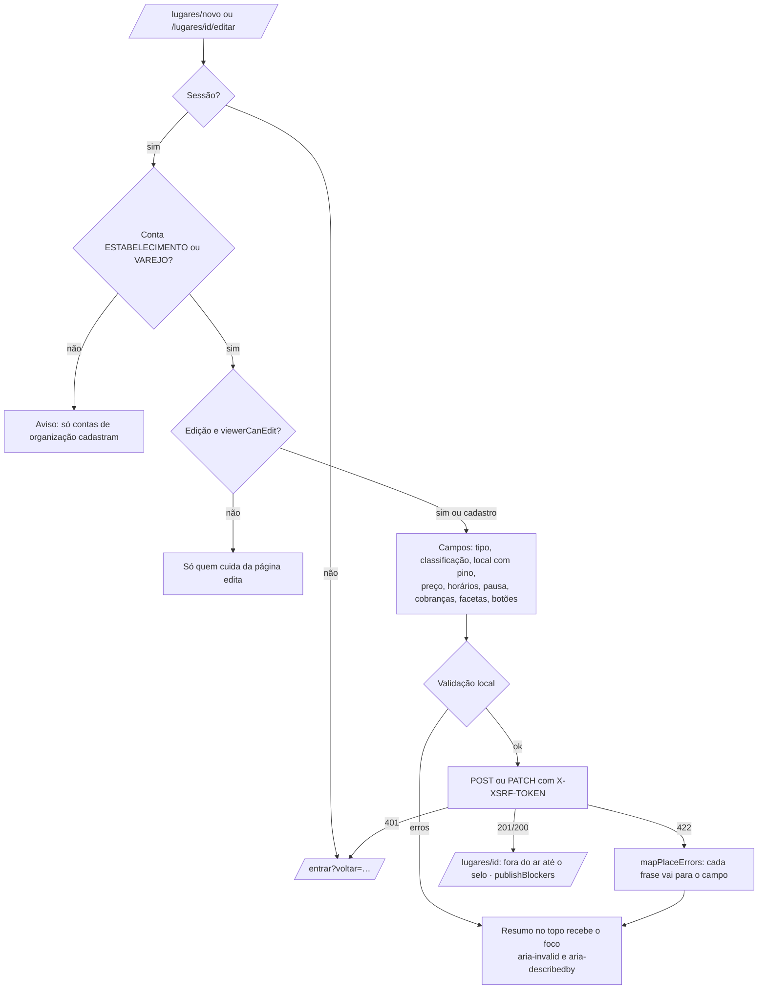

# RF11 · Atividades

## Gravar os blocos do RF11 (`POST` ou `PATCH /api/v1/establishments[/id]`)

```mermaid
flowchart TD
    A[Pedido com hours, temporaryClosure,<br/>charges, facets e actions] --> E{PlaceEditors.canEdit?<br/>no PATCH}
    E -- não --> N404[404]
    E -- sim --> RF6[Regras do RF6 e do RF7:<br/>tipo, local, preço, classificação]
    RF6 --> Z[Fuso do lugar pela UF<br/>e hoje nesse fuso]
    Z --> F{facets veio?}
    F -- sim --> FV{Código conhecido, declarável,<br/>valor aceito, grupo certo?}
    F -- não, mas o tipo mudou --> FR[Revalida as facetas gravadas<br/>no grupo novo]
    FV -. erros .-> ERR
    FR -. erros .-> ERR
    FV --> H{hours veio?}
    FR --> H
    F -- não --> H
    H -- sim --> HV{Até 3 faixas, HH:MM, sem sobrepor,<br/>madrugada sem invadir o dia seguinte?<br/>Datas: até 60, até 1 ano, sem repetir,<br/>no máximo 7 dias seguidos fechados}
    HV -. erros .-> ERR
    HV --> HD[Datas que já passaram são descartadas]
    H -- não --> T
    HD --> T{temporaryClosure veio?}
    T -- sim --> TV{Data de volta depois de hoje<br/>e até 1 ano, só com a pausa?}
    TV -. erros .-> ERR
    T -- não --> C
    TV --> C{charges veio?}
    C -- sim --> CV{Sem consumação mínima, taxa 1–20%,<br/>couvert artístico com dias e música ao vivo,<br/>uma condição por forma aceita, 1–20%?}
    C -- não, mas facets veio --> CR[Revalida as cobranças gravadas<br/>contra as facetas novas]
    CV -. erros .-> ERR
    CR -. erros .-> ERR
    CV --> L
    CR --> L
    C -- não --> L{actions veio?}
    L -- sim --> LV{Provedor conhecido, um link cada,<br/>HTTPS no domínio do provedor,<br/>até 2 reservas e 5 deliveries,<br/>um preferido, WhatsApp com DDD?}
    LV -. erros .-> ERR
    L -- não --> ERR
    LV --> ERR{Algum erro?}
    ERR -- sim --> E422[422 com todos os erros<br/>nada gravado]
    ERR -- não --> AP[Aplica os blocos<br/>cobranças mudaram → nova data de declaração]
    AP --> DB[(UPDATE establishment)]
    DB --> OK[201 ou 200 com a página do dono]
```

## "Aberto agora" (`OpeningHours.status`)

```mermaid
flowchart TD
    S[Instante atual no fuso do lugar] --> P{status CLOSED?}
    P -- sim --> PC[Fechou de vez]
    P -- não --> T{Fechado temporariamente?}
    T -- sim --> D{Tem data de volta<br/>e hoje é antes dela?}
    D -- "sem data" --> TC[Fechado temporariamente]
    D -- antes --> TC2[Fechado temporariamente · volta em dd/mm/aaaa]
    D -- "chegou ou passou" --> MC[Pode estar fechado:<br/>o estabelecimento ainda não confirmou]
    T -- não --> O{Dentro de uma faixa de ontem<br/>que passa da meia-noite ou de hoje?}
    O -- sim --> J[Junta faixas encostadas] --> OP[Aberto agora · fecha às HH:MM<br/>ou à meia-noite · em N min na última hora<br/>ou Aberto 24 horas]
    O -- não --> U{Sem horário da semana e<br/>sem data especial hoje e ontem?}
    U -- sim --> UN[Horário não informado]
    U -- não --> N{Próxima abertura<br/>nos próximos 7 dias?}
    N -- sim --> CL[Fechado agora · abre às, amanhã às,<br/>terça às ou em dd/mm às]
    N -- não --> CL2[Fechado agora · sem horário nos próximos 7 dias]
```

## Formulário do dono (app web)

```mermaid
flowchart TD
    A[/lugares/novo ou /lugares/id/editar/] --> S{Sessão?}
    S -- não --> L[/entrar?voltar=…/]
    S -- sim --> K{Conta ESTABELECIMENTO ou VAREJO?}
    K -- não --> M[Aviso: só contas de organização cadastram]
    K -- sim --> E{Edição e viewerCanEdit?}
    E -- não --> M2[Só quem cuida da página edita]
    E -- sim ou cadastro --> F[Campos: tipo, classificação, local com pino,<br/>preço, horários, pausa, cobranças, facetas, botões]
    F --> V{Validação local}
    V -- erros --> R[Resumo no topo recebe o foco<br/>aria-invalid e aria-describedby]
    V -- ok --> API[POST ou PATCH com X-XSRF-TOKEN]
    API -- 422 --> MAP[mapPlaceErrors: cada frase vai para o campo] --> R
    API -- 401 --> L
    API -- 201/200 --> P[/lugares/id: fora do ar até o selo · publishBlockers/]
```
