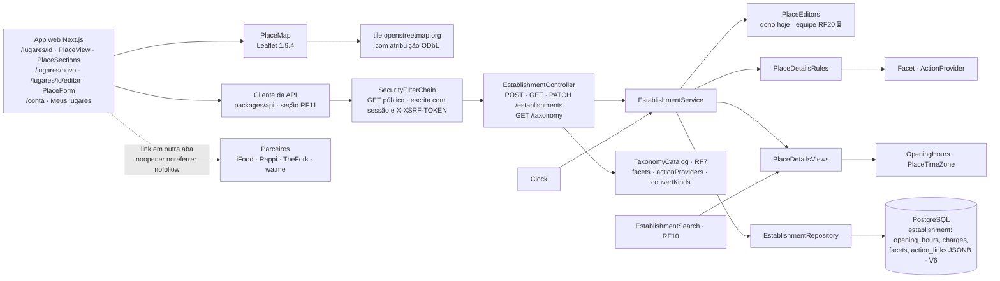

# RF11 · Componentes

```mermaid
flowchart LR
    WEB["App web Next.js<br/>/lugares/id · PlaceView · PlaceSections<br/>/lugares/novo · /lugares/id/editar · PlaceForm<br/>/conta · Meus lugares"] --> APP["Cliente da API<br/>packages/api · seção RF11"]
    WEB --> MAP["PlaceMap<br/>Leaflet 1.9.4"]
    MAP --> OSM["tile.openstreetmap.org<br/>com atribuição ODbL"]
    WEB -. "link em outra aba<br/>noopener noreferrer nofollow" .-> EXT["Parceiros<br/>iFood · Rappi · TheFork · wa.me"]
    APP --> SEC["SecurityFilterChain<br/>GET público · escrita com sessão e X-XSRF-TOKEN"]
    SEC --> EC["EstablishmentController<br/>POST · GET · PATCH /establishments<br/>GET /taxonomy"]
    EC --> ES["EstablishmentService"]
    EC --> TC["TaxonomyCatalog · RF7<br/>facets · actionProviders · couvertKinds"]
    ES --> ED["PlaceEditors<br/>dono hoje · equipe RF20 ⏳"]
    ES --> PR["PlaceDetailsRules"]
    ES --> PV["PlaceDetailsViews"]
    PV --> OH["OpeningHours · PlaceTimeZone"]
    PR --> TX["Facet · ActionProvider"]
    ES --> ER["EstablishmentRepository"]
    ER --> PG[("PostgreSQL<br/>establishment: opening_hours, charges,<br/>facets, action_links JSONB · V6")]
    SR["EstablishmentSearch · RF10"] --> PV
    CLK["Clock"] --> ES
```
