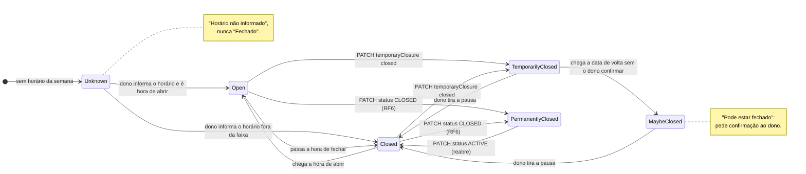
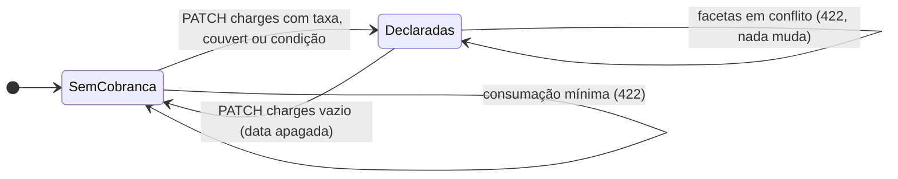

# RF11 · Estados

## Funcionamento do lugar (`openStatus.state`)

```mermaid
stateDiagram-v2
    direction LR
    [*] --> Unknown : sem horário da semana
    Unknown --> Open : dono informa o horário e é hora de abrir
    Unknown --> Closed : dono informa o horário fora da faixa
    Closed --> Open : chega a hora de abrir
    Open --> Closed : passa a hora de fechar
    Open --> TemporarilyClosed : PATCH temporaryClosure closed
    Closed --> TemporarilyClosed : PATCH temporaryClosure closed
    TemporarilyClosed --> MaybeClosed : chega a data de volta sem o dono confirmar
    TemporarilyClosed --> Closed : dono tira a pausa
    MaybeClosed --> Closed : dono tira a pausa
    Open --> PermanentlyClosed : PATCH status CLOSED (RF6)
    Closed --> PermanentlyClosed : PATCH status CLOSED (RF6)
    PermanentlyClosed --> Closed : PATCH status ACTIVE (reabre)
    note right of Unknown
        "Horário não informado",
        nunca "Fechado".
    end note
    note right of MaybeClosed
        "Pode estar fechado":
        pede confirmação ao dono.
    end note
```

## Cobranças declaradas

```mermaid
stateDiagram-v2
    direction LR
    [*] --> SemCobranca
    SemCobranca --> Declaradas : PATCH charges com taxa, couvert ou condição
    Declaradas --> Declaradas : PATCH com outro valor (nova data de declaração)
    Declaradas --> Declaradas : PATCH igual (data mantida)
    Declaradas --> SemCobranca : PATCH charges vazio (data apagada)
    SemCobranca --> SemCobranca : consumação mínima (422)
    Declaradas --> Declaradas : facetas em conflito (422, nada muda)
```
