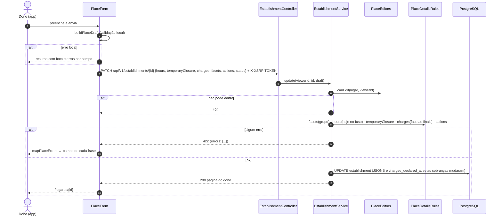
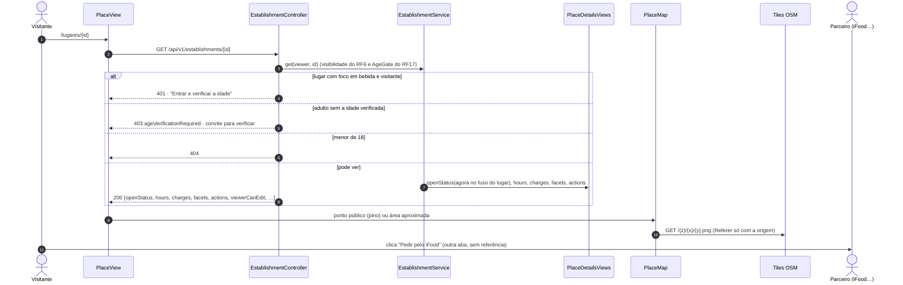

# RF11 · Sequência

## Dono declara horários, cobranças, facetas e botões

```mermaid
sequenceDiagram
    autonumber
    actor D as Dono (app)
    participant W as PlaceForm
    participant API as EstablishmentController
    participant S as EstablishmentService
    participant E as PlaceEditors
    participant R as PlaceDetailsRules
    participant DB as PostgreSQL

    D->>W: preenche e envia
    W->>W: buildPlaceDraft (validação local)
    alt erro local
        W-->>D: resumo com foco e erros por campo
    end
    W->>API: PATCH /api/v1/establishments/{id} {hours, temporaryClosure, charges, facets, actions, status} + X-XSRF-TOKEN
    API->>S: update(viewerId, id, draft)
    S->>E: canEdit(lugar, viewerId)
    alt não pode editar
        S-->>W: 404
    end
    S->>R: facets(grupo) · hours(hoje no fuso) · temporaryClosure · charges(facetas finais) · actions
    alt algum erro
        S-->>W: 422 {errors: [...]}
        W-->>D: mapPlaceErrors → campo de cada frase
    else ok
        S->>DB: UPDATE establishment (JSONB e charges_declared_at se as cobranças mudaram)
        S-->>W: 200 página do dono
        W-->>D: /lugares/{id}
    end
```

## Visitante abre a página

```mermaid
sequenceDiagram
    autonumber
    actor V as Visitante
    participant P as PlaceView
    participant API as EstablishmentController
    participant S as EstablishmentService
    participant PV as PlaceDetailsViews
    participant M as PlaceMap
    participant T as Tiles OSM
    actor X as Parceiro (iFood…)

    V->>P: /lugares/{id}
    P->>API: GET /api/v1/establishments/{id}
    API->>S: get(viewer, id) (visibilidade do RF6 e AgeGate do RF17)
    alt lugar com foco em bebida e visitante
        API-->>P: 401 · "Entrar e verificar a idade"
    else adulto sem a idade verificada
        API-->>P: 403 ageVerificationRequired · convite para verificar
    else menor de 18
        API-->>P: 404
    else pode ver
        S->>PV: openStatus(agora no fuso do lugar), hours, charges, facets, actions
        API-->>P: 200 {openStatus, hours, charges, facets, actions, viewerCanEdit, …}
    end
    P->>M: ponto público (pino) ou área aproximada
    M->>T: GET /{z}/{x}/{y}.png (Referer só com a origem)
    V->>X: clica "Pedir pelo iFood" (outra aba, sem referência)
```
