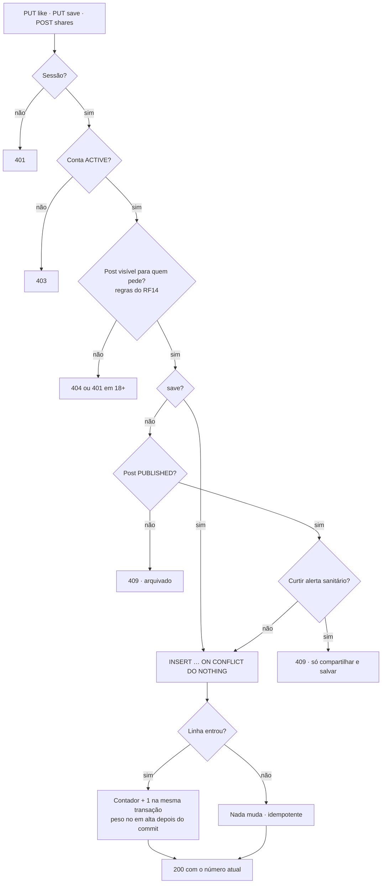
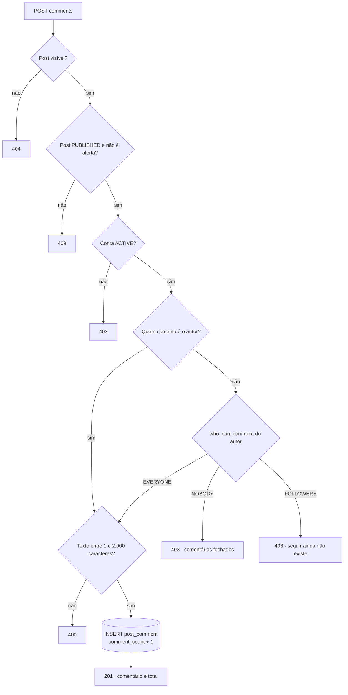

# RF12 · Atividades

## Curtir, salvar e compartilhar

```mermaid
flowchart TD
    A[PUT like · PUT save · POST shares] --> S{Sessão?}
    S -- não --> E401[401]
    S -- sim --> AT{Conta ACTIVE?}
    AT -- não --> E403[403]
    AT -- sim --> V{Post visível para quem pede?<br/>regras do RF14}
    V -- não --> E404[404 ou 401 em 18+]
    V -- sim --> SV{save?}
    SV -- sim --> INS
    SV -- não --> O{Post PUBLISHED?}
    O -- não --> E409[409 · arquivado]
    O -- sim --> AL{Curtir alerta sanitário?}
    AL -- sim --> E409A[409 · só compartilhar e salvar]
    AL -- não --> INS[INSERT … ON CONFLICT DO NOTHING]
    INS --> NEW{Linha entrou?}
    NEW -- sim --> C[Contador + 1 na mesma transação<br/>peso no em alta depois do commit]
    NEW -- não --> SAME[Nada muda · idempotente]
    C & SAME --> OK[200 com o número atual]
```

## Comentar

```mermaid
flowchart TD
    P[POST comments] --> V{Post visível?}
    V -- não --> E404[404]
    V -- sim --> PUB{Post PUBLISHED e não é alerta?}
    PUB -- não --> E409[409]
    PUB -- sim --> AC{Conta ACTIVE?}
    AC -- não --> E403A[403]
    AC -- sim --> AU{Quem comenta é o autor?}
    AU -- sim --> W
    AU -- não --> WHO{who_can_comment do autor}
    WHO -- EVERYONE --> W
    WHO -- NOBODY --> E403N[403 · comentários fechados]
    WHO -- FOLLOWERS --> E403F[403 · seguir ainda não existe]
    W{Texto entre 1 e 2.000 caracteres?}
    W -- não --> E400[400]
    W -- sim --> SAVE[(INSERT post_comment<br/>comment_count + 1)]
    SAVE --> OK[201 · comentário e total]
```
