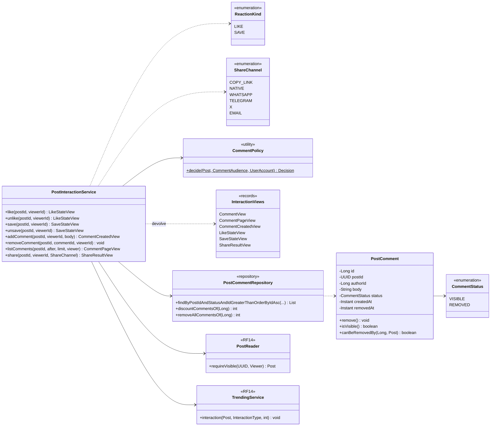

# RF12 · Classes

```mermaid
classDiagram
    direction LR
    class PostComment {
        -Long id
        -UUID postId
        -Long authorId
        -String body
        -CommentStatus status
        -Instant createdAt
        -Instant removedAt
        +remove() void
        +isVisible() boolean
        +canBeRemovedBy(Long, Post) boolean
    }
    class CommentStatus {
        <<enumeration>>
        VISIBLE
        REMOVED
    }
    class ReactionKind {
        <<enumeration>>
        LIKE
        SAVE
    }
    class ShareChannel {
        <<enumeration>>
        COPY_LINK
        NATIVE
        WHATSAPP
        TELEGRAM
        X
        EMAIL
    }
    class CommentPolicy {
        <<utility>>
        +decide(Post, CommentAudience, UserAccount)$ Decision
    }
    class PostInteractionService {
        +like(postId, viewerId) LikeStateView
        +unlike(postId, viewerId) LikeStateView
        +save(postId, viewerId) SaveStateView
        +unsave(postId, viewerId) SaveStateView
        +addComment(postId, viewerId, body) CommentCreatedView
        +removeComment(postId, commentId, viewerId) void
        +listComments(postId, after, limit, viewer) CommentPageView
        +share(postId, viewerId, ShareChannel) ShareResultView
    }
    class InteractionViews {
        <<records>>
        CommentView
        CommentPageView
        CommentCreatedView
        LikeStateView
        SaveStateView
        ShareResultView
    }
    class PostCommentRepository {
        <<repository>>
        +findByPostIdAndStatusAndIdGreaterThanOrderByIdAsc(...) List
        +discountCommentsOf(Long) int
        +removeAllCommentsOf(Long) int
    }
    class PostReader {
        <<RF14>>
        +requireVisible(UUID, Viewer) Post
    }
    class TrendingService {
        <<RF14>>
        +interaction(Post, InteractionType, int) void
    }
    PostInteractionService --> CommentPolicy
    PostInteractionService --> PostReader
    PostInteractionService --> PostCommentRepository
    PostInteractionService --> TrendingService
    PostInteractionService ..> InteractionViews : devolve
    PostCommentRepository ..> PostComment
    PostComment --> CommentStatus
    PostInteractionService ..> ReactionKind
    PostInteractionService ..> ShareChannel
```
