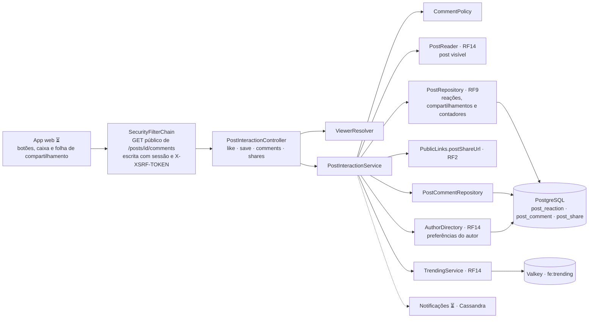

# RF12 · Componentes

```mermaid
flowchart LR
    APP["App web ⏳<br/>botões, caixa e folha de compartilhamento"] --> SEC["SecurityFilterChain<br/>GET público de /posts/id/comments<br/>escrita com sessão e X-XSRF-TOKEN"]
    SEC --> IC["PostInteractionController<br/>like · save · comments · shares"]
    IC --> VR["ViewerResolver"]
    IC --> IS["PostInteractionService"]
    IS --> CP["CommentPolicy"]
    IS --> RD["PostReader · RF14<br/>post visível"]
    IS --> AD["AuthorDirectory · RF14<br/>preferências do autor"]
    IS --> PL["PublicLinks.postShareUrl · RF2"]
    IS --> TS["TrendingService · RF14"]
    IS --> PR["PostRepository · RF9<br/>reações, compartilhamentos e contadores"]
    IS --> CR["PostCommentRepository"]
    PR & CR --> PG[("PostgreSQL<br/>post_reaction · post_comment · post_share")]
    AD --> PG
    TS --> VK[("Valkey · fe:trending")]
    IS -.-> NT["Notificações ⏳ · Cassandra"]
```
