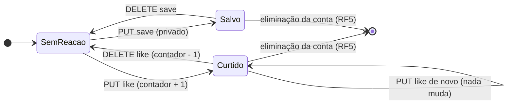
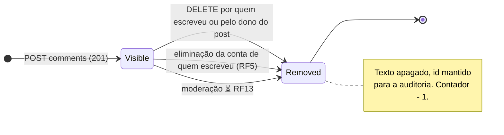
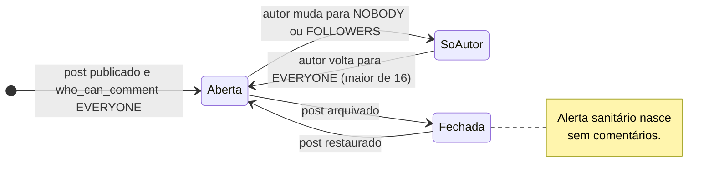

# RF12 · Estados

## Curtida e salvo de uma conta num post

```mermaid
stateDiagram-v2
    direction LR
    [*] --> SemReacao
    SemReacao --> Curtido : PUT like (contador + 1)
    Curtido --> Curtido : PUT like de novo (nada muda)
    Curtido --> SemReacao : DELETE like (contador - 1)
    SemReacao --> Salvo : PUT save (privado)
    Salvo --> SemReacao : DELETE save
    Curtido --> [*] : eliminação da conta (RF5)
    Salvo --> [*] : eliminação da conta (RF5)
```

## Comentário (`post_comment.status`)

```mermaid
stateDiagram-v2
    direction LR
    [*] --> Visible : POST comments (201)
    Visible --> Removed : DELETE por quem escreveu ou pelo dono do post
    Visible --> Removed : eliminação da conta de quem escreveu (RF5)
    Visible --> Removed : moderação ⏳ RF13
    Removed --> [*]
    note right of Removed
        Texto apagado, id mantido
        para a auditoria. Contador - 1.
    end note
```

## Caixa de comentários de um post

```mermaid
stateDiagram-v2
    direction LR
    [*] --> Aberta : post publicado e who_can_comment EVERYONE
    Aberta --> SoAutor : autor muda para NOBODY ou FOLLOWERS
    SoAutor --> Aberta : autor volta para EVERYONE (maior de 16)
    Aberta --> Fechada : post arquivado
    Fechada --> Aberta : post restaurado
    note right of Fechada
        Alerta sanitário nasce
        sem comentários.
    end note
```
