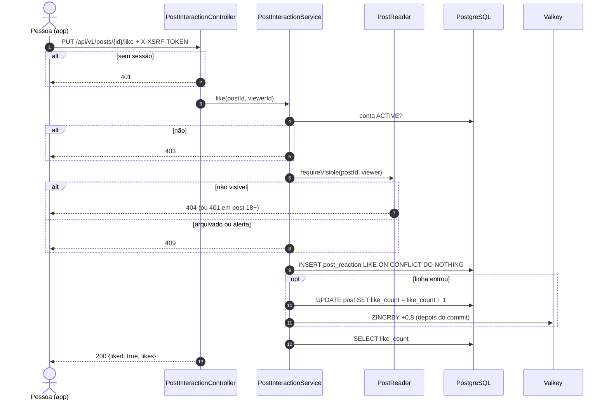
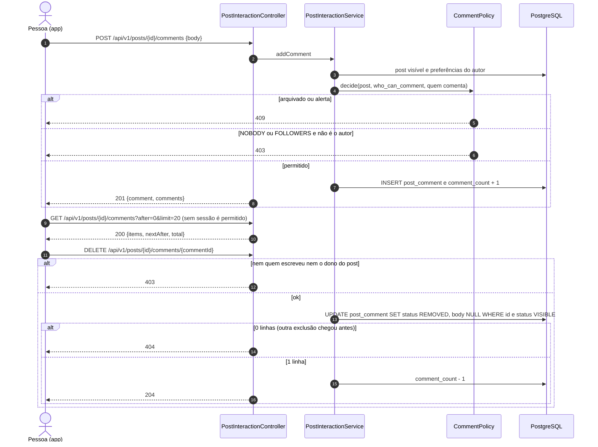
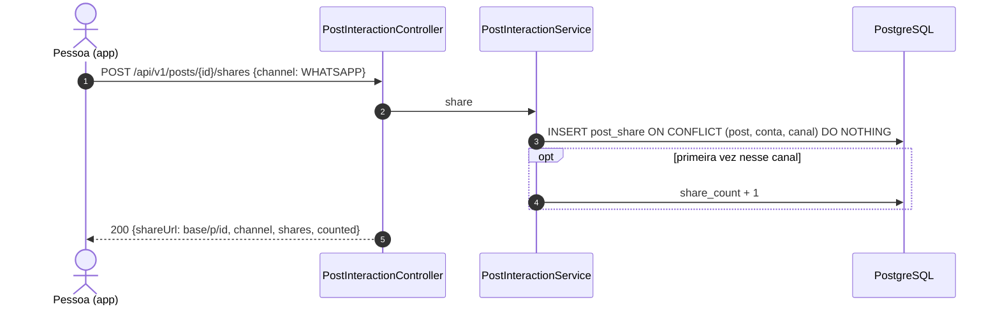

# RF12 · Sequência

## Curtir (idempotente)

```mermaid
sequenceDiagram
    autonumber
    actor U as Pessoa (app)
    participant API as PostInteractionController
    participant S as PostInteractionService
    participant R as PostReader
    participant DB as PostgreSQL
    participant V as Valkey

    U->>API: PUT /api/v1/posts/{id}/like + X-XSRF-TOKEN
    alt sem sessão
        API-->>U: 401
    end
    API->>S: like(postId, viewerId)
    S->>DB: conta ACTIVE?
    alt não
        S-->>U: 403
    end
    S->>R: requireVisible(postId, viewer)
    alt não visível
        R-->>U: 404 (ou 401 em post 18+)
    else arquivado ou alerta
        S-->>U: 409
    end
    S->>DB: INSERT post_reaction LIKE ON CONFLICT DO NOTHING
    opt linha entrou
        S->>DB: UPDATE post SET like_count = like_count + 1
        S->>V: ZINCRBY +0,8 (depois do commit)
    end
    S->>DB: SELECT like_count
    API-->>U: 200 {liked: true, likes}
```

## Comentar e apagar

```mermaid
sequenceDiagram
    autonumber
    actor U as Pessoa (app)
    participant API as PostInteractionController
    participant S as PostInteractionService
    participant P as CommentPolicy
    participant DB as PostgreSQL

    U->>API: POST /api/v1/posts/{id}/comments {body}
    API->>S: addComment
    S->>DB: post visível e preferências do autor
    S->>P: decide(post, who_can_comment, quem comenta)
    alt arquivado ou alerta
        P-->>U: 409
    else NOBODY ou FOLLOWERS e não é o autor
        P-->>U: 403
    else permitido
        S->>DB: INSERT post_comment e comment_count + 1
        API-->>U: 201 {comment, comments}
    end
    U->>API: GET /api/v1/posts/{id}/comments?after=0&limit=20 (sem sessão é permitido)
    API-->>U: 200 {items, nextAfter, total}
    U->>API: DELETE /api/v1/posts/{id}/comments/{commentId}
    alt nem quem escreveu nem o dono do post
        API-->>U: 403
    else ok
        S->>DB: UPDATE post_comment SET status REMOVED, body NULL WHERE id e status VISIBLE
        alt 0 linhas (outra exclusão chegou antes)
            API-->>U: 404
        else 1 linha
            S->>DB: comment_count - 1
            API-->>U: 204
        end
    end
```

## Compartilhar

```mermaid
sequenceDiagram
    autonumber
    actor U as Pessoa (app)
    participant API as PostInteractionController
    participant S as PostInteractionService
    participant DB as PostgreSQL

    U->>API: POST /api/v1/posts/{id}/shares {channel: WHATSAPP}
    API->>S: share
    S->>DB: INSERT post_share ON CONFLICT (post, conta, canal) DO NOTHING
    opt primeira vez nesse canal
        S->>DB: share_count + 1
    end
    API-->>U: 200 {shareUrl: base/p/id, channel, shares, counted}
```
