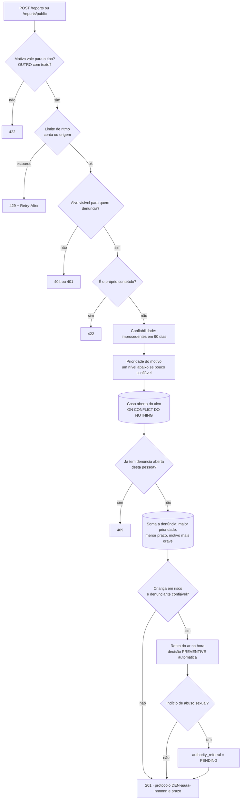
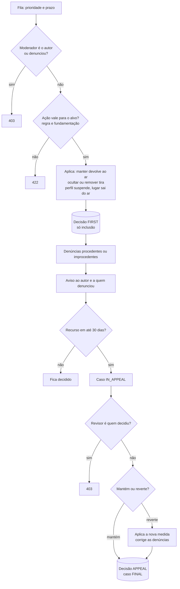
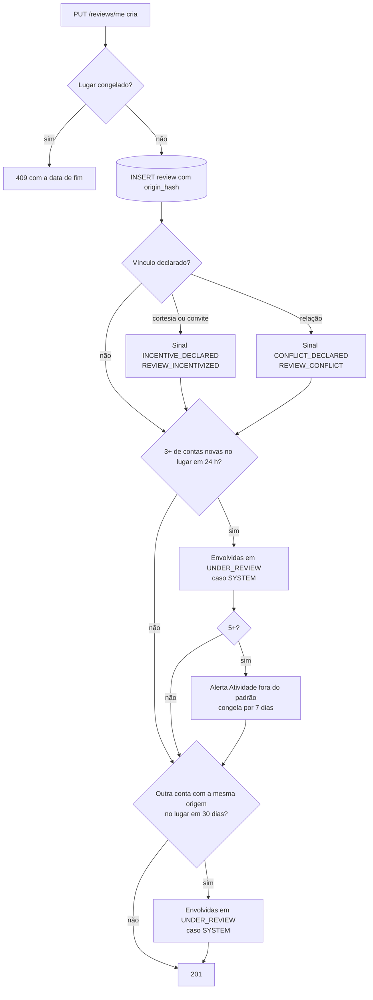

# RF13 · Atividades

## Denunciar

```mermaid
flowchart TD
    A[POST /reports ou /reports/public] --> F{Motivo vale para o tipo?<br/>OUTRO com texto?}
    F -- não --> E422[422]
    F -- sim --> R{Limite de ritmo<br/>conta ou origem}
    R -- estourou --> E429[429 + Retry-After]
    R -- ok --> V{Alvo visível para quem denuncia?}
    V -- não --> E404[404 ou 401]
    V -- sim --> O{É o próprio conteúdo?}
    O -- sim --> E422B[422]
    O -- não --> T[Confiabilidade: improcedentes em 90 dias]
    T --> P[Prioridade do motivo<br/>um nível abaixo se pouco confiável]
    P --> C[(Caso aberto do alvo<br/>ON CONFLICT DO NOTHING)]
    C --> D{Já tem denúncia aberta<br/>desta pessoa?}
    D -- sim --> E409[409]
    D -- não --> S[(Soma a denúncia: maior prioridade,<br/>menor prazo, motivo mais grave)]
    S --> K{Criança em risco<br/>e denunciante confiável?}
    K -- sim --> H[Retira do ar na hora<br/>decisão PREVENTIVE automática]
    K -- não --> RC
    H --> AB{Indício de abuso sexual?}
    AB -- sim --> PEND[authority_referral = PENDING]
    AB -- não --> RC
    PEND --> RC[201 · protocolo DEN-aaaa-nnnnnn e prazo]
```

## Decidir e recorrer

```mermaid
flowchart TD
    Q[Fila: prioridade e prazo] --> M{Moderador é o autor<br/>ou denunciou?}
    M -- sim --> E403[403]
    M -- não --> AC{Ação vale para o alvo?<br/>regra e fundamentação}
    AC -- não --> E422[422]
    AC -- sim --> AP[Aplica: manter devolve ao ar<br/>ocultar ou remover tira<br/>perfil suspende, lugar sai do ar]
    AP --> HI[(Decisão FIRST<br/>só inclusão)]
    HI --> RES[Denúncias procedentes ou improcedentes]
    RES --> AV[Aviso ao autor e a quem denunciou]
    AV --> PR{Recurso em até 30 dias?}
    PR -- não --> FIM[Fica decidido]
    PR -- sim --> REC[Caso IN_APPEAL]
    REC --> OM{Revisor é quem decidiu?}
    OM -- sim --> E403B[403]
    OM -- não --> MR{Mantém ou reverte?}
    MR -- mantém --> FIN[(Decisão APPEAL<br/>caso FINAL)]
    MR -- reverte --> NA[Aplica a nova medida<br/>corrige as denúncias] --> FIN
```

## Integridade de uma avaliação nova

```mermaid
flowchart TD
    N[PUT /reviews/me cria] --> FR{Lugar congelado?}
    FR -- sim --> E409[409 com a data de fim]
    FR -- não --> SV[(INSERT review com origin_hash)]
    SV --> DC{Vínculo declarado?}
    DC -- cortesia ou convite --> S1[Sinal INCENTIVE_DECLARED<br/>REVIEW_INCENTIVIZED]
    DC -- relação --> S2[Sinal CONFLICT_DECLARED<br/>REVIEW_CONFLICT]
    DC -- não --> B
    S1 & S2 --> B{3+ de contas novas no lugar em 24 h?}
    B -- sim --> UR[Envolvidas em UNDER_REVIEW<br/>caso SYSTEM]
    B -- não --> SO
    UR --> FZ{5+?}
    FZ -- sim --> AL[Alerta Atividade fora do padrão<br/>congela por 7 dias]
    FZ -- não --> SO
    AL --> SO{Outra conta com a mesma origem<br/>no lugar em 30 dias?}
    SO -- sim --> UR2[Envolvidas em UNDER_REVIEW<br/>caso SYSTEM]
    SO -- não --> OK[201]
    UR2 --> OK
```
