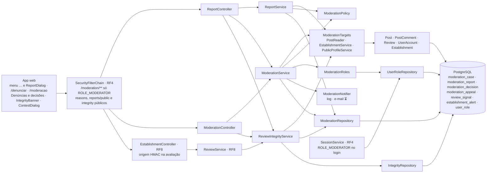

# RF13 · Componentes

```mermaid
flowchart LR
    APP["App web<br/>menu … e ReportDialog · /denunciar · /moderacao<br/>Denúncias e decisões · IntegrityBanner · ContestDialog"] --> SEC["SecurityFilterChain · RF4<br/>/moderation/** só ROLE_MODERATOR<br/>reasons, reports/public e integrity públicos"]
    SEC --> RC["ReportController"]
    SEC --> MC["ModerationController"]
    SEC --> EC["EstablishmentController · RF8<br/>origem HMAC na avaliação"]
    RC --> RS["ReportService"]
    RC --> MS["ModerationService"]
    RC --> IS["ReviewIntegrityService"]
    MC --> MS
    MC --> IS
    EC --> RV["ReviewService · RF8"] --> IS
    RS & MS & IS --> TG["ModerationTargets<br/>PostReader · EstablishmentService · PublicProfileService"]
    RS & MS --> PO["ModerationPolicy"]
    MS --> RO["ModerationRoles"]
    MS --> NT["ModerationNotifier<br/>log · e-mail ⏳"]
    RS & MS & IS --> MR["ModerationRepository"]
    IS --> IR["IntegrityRepository"]
    RO --> UR["UserRoleRepository"]
    SS["SessionService · RF4<br/>ROLE_MODERATOR no login"] --> UR
    TG --> JPA["Post · PostComment · Review · UserAccount · Establishment"]
    MR & IR & UR & JPA --> PG[("PostgreSQL<br/>moderation_case · moderation_report · moderation_decision<br/>moderation_appeal · review_signal · establishment_alert · user_role")]
```
