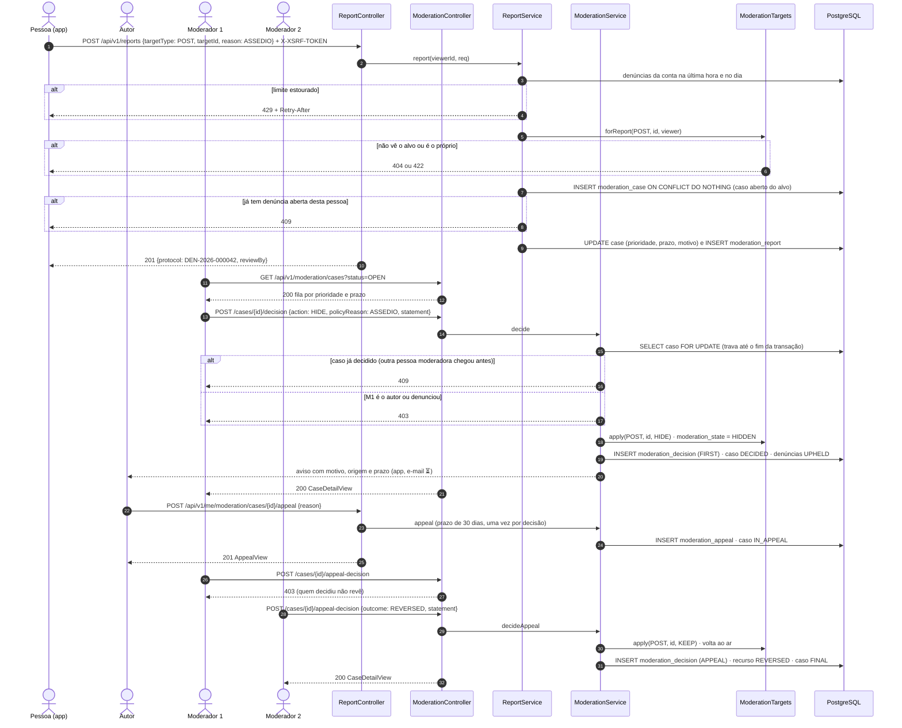
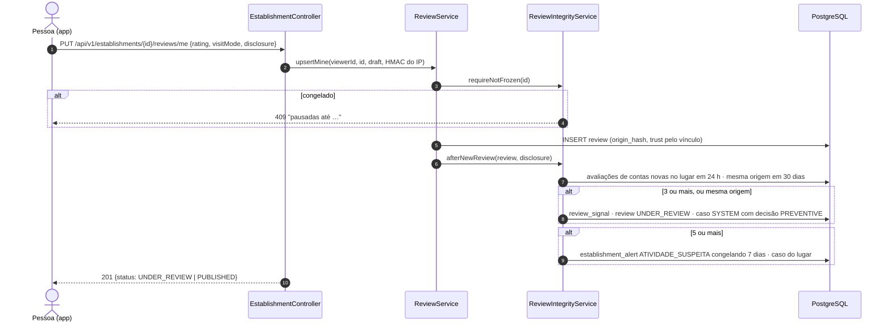

# RF13 · Sequência

## Denúncia, decisão e recurso

```mermaid
sequenceDiagram
    autonumber
    actor P as Pessoa (app)
    actor A as Autor
    actor M1 as Moderador 1
    actor M2 as Moderador 2
    participant RC as ReportController
    participant MC as ModerationController
    participant RS as ReportService
    participant MS as ModerationService
    participant TG as ModerationTargets
    participant DB as PostgreSQL

    P->>RC: POST /api/v1/reports {targetType: POST, targetId, reason: ASSEDIO} + X-XSRF-TOKEN
    RC->>RS: report(viewerId, req)
    RS->>DB: denúncias da conta na última hora e no dia
    alt limite estourado
        RS-->>P: 429 + Retry-After
    end
    RS->>TG: forReport(POST, id, viewer)
    alt não vê o alvo ou é o próprio
        TG-->>P: 404 ou 422
    end
    RS->>DB: INSERT moderation_case ON CONFLICT DO NOTHING (caso aberto do alvo)
    alt já tem denúncia aberta desta pessoa
        RS-->>P: 409
    end
    RS->>DB: UPDATE case (prioridade, prazo, motivo) e INSERT moderation_report
    RC-->>P: 201 {protocol: DEN-2026-000042, reviewBy}

    M1->>MC: GET /api/v1/moderation/cases?status=OPEN
    MC-->>M1: 200 fila por prioridade e prazo
    M1->>MC: POST /cases/{id}/decision {action: HIDE, policyReason: ASSEDIO, statement}
    MC->>MS: decide
    MS->>DB: SELECT caso FOR UPDATE (trava até o fim da transação)
    alt caso já decidido (outra pessoa moderadora chegou antes)
        MS-->>M1: 409
    else M1 é o autor ou denunciou
        MS-->>M1: 403
    end
    MS->>TG: apply(POST, id, HIDE) · moderation_state = HIDDEN
    MS->>DB: INSERT moderation_decision (FIRST) · caso DECIDED · denúncias UPHELD
    MS-->>A: aviso com motivo, origem e prazo (app, e-mail ⏳)
    MC-->>M1: 200 CaseDetailView

    A->>RC: POST /api/v1/me/moderation/cases/{id}/appeal {reason}
    RC->>MS: appeal (prazo de 30 dias, uma vez por decisão)
    MS->>DB: INSERT moderation_appeal · caso IN_APPEAL
    RC-->>A: 201 AppealView
    M1->>MC: POST /cases/{id}/appeal-decision
    MC-->>M1: 403 (quem decidiu não revê)
    M2->>MC: POST /cases/{id}/appeal-decision {outcome: REVERSED, statement}
    MC->>MS: decideAppeal
    MS->>TG: apply(POST, id, KEEP) · volta ao ar
    MS->>DB: INSERT moderation_decision (APPEAL) · recurso REVERSED · caso FINAL
    MC-->>M2: 200 CaseDetailView
```

## Avaliação nova com sinal de fraude

```mermaid
sequenceDiagram
    autonumber
    actor P as Pessoa (app)
    participant EC as EstablishmentController
    participant RV as ReviewService
    participant IS as ReviewIntegrityService
    participant DB as PostgreSQL

    P->>EC: PUT /api/v1/establishments/{id}/reviews/me {rating, visitMode, disclosure}
    EC->>RV: upsertMine(viewerId, id, draft, HMAC do IP)
    RV->>IS: requireNotFrozen(id)
    alt congelado
        IS-->>P: 409 "pausadas até …"
    end
    RV->>DB: INSERT review (origin_hash, trust pelo vínculo)
    RV->>IS: afterNewReview(review, disclosure)
    IS->>DB: avaliações de contas novas no lugar em 24 h · mesma origem em 30 dias
    alt 3 ou mais, ou mesma origem
        IS->>DB: review_signal · review UNDER_REVIEW · caso SYSTEM com decisão PREVENTIVE
    end
    alt 5 ou mais
        IS->>DB: establishment_alert ATIVIDADE_SUSPEITA congelando 7 dias · caso do lugar
    end
    EC-->>P: 201 {status: UNDER_REVIEW | PUBLISHED}
```
