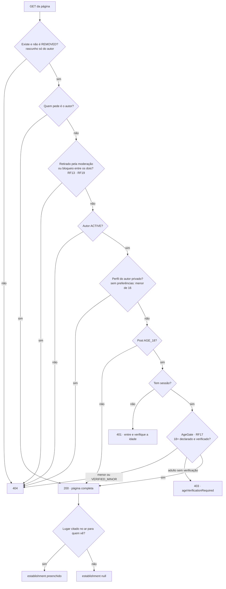
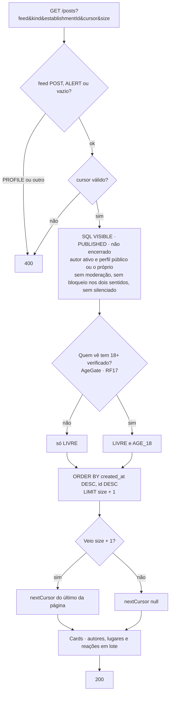
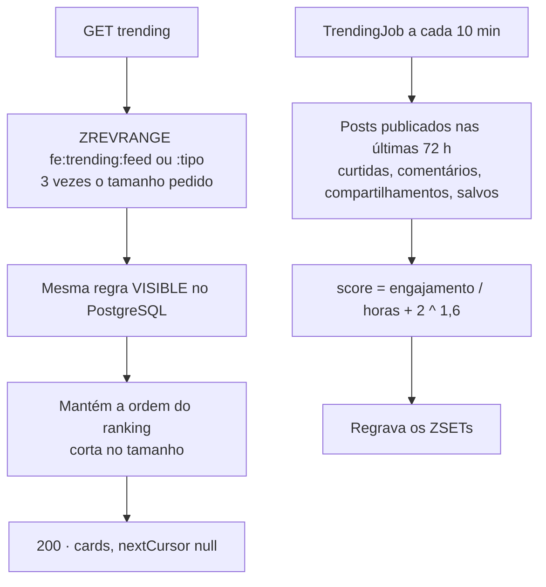

# RF14 · Atividades

## Abrir a página do post (`GET /api/v1/posts/{id}`)

```mermaid
flowchart TD
    G[GET da página] --> X{Existe e não é REMOVED?<br/>rascunho só do autor}
    X -- não --> N404[404]
    X -- sim --> A{Quem pede é o autor?}
    A -- sim --> OK
    A -- não --> MO{Retirado pela moderação<br/>ou bloqueio entre os dois? RF13 · RF19}
    MO -- sim --> N404
    MO -- não --> AC{Autor ACTIVE?}
    AC -- não --> N404
    AC -- sim --> PR{Perfil do autor privado?<br/>sem preferências: menor de 16}
    PR -- sim --> N404
    PR -- não --> R{Post AGE_18?}
    R -- não --> OK
    R -- sim --> L{Tem sessão?}
    L -- não --> N401[401 · entre e verifique a idade]
    L -- sim --> AD{AgeGate · RF17<br/>18+ declarado e verificado?}
    AD -- "menor ou VERIFIED_MINOR" --> N404
    AD -- "adulto sem verificação" --> N403[403 · ageVerificationRequired]
    AD -- sim --> OK[200 · página completa]
    OK --> P{Lugar citado no ar para quem vê?}
    P -- sim --> PL[establishment preenchido]
    P -- não --> PN[establishment null]
```

## Feed com cursor (`GET /api/v1/posts`)

```mermaid
flowchart TD
    F[GET /posts?feed&kind&establishmentId&cursor&size] --> V{feed POST, ALERT ou vazio?}
    V -- PROFILE ou outro --> E400[400]
    V -- ok --> C{cursor válido?}
    C -- não --> E400
    C -- sim --> Q[SQL VISIBLE · PUBLISHED · não encerrado<br/>autor ativo e perfil público ou o próprio<br/>sem moderação, sem bloqueio nos dois sentidos, sem silenciado]
    Q --> AG{Quem vê tem 18+ verificado?<br/>AgeGate · RF17}
    AG -- não --> LV[só LIVRE]
    AG -- sim --> ALL[LIVRE e AGE_18]
    LV & ALL --> ORD[ORDER BY created_at DESC, id DESC<br/>LIMIT size + 1]
    ORD --> M{Veio size + 1?}
    M -- sim --> NC[nextCursor do último da página]
    M -- não --> END[nextCursor null]
    NC & END --> CARDS[Cards · autores, lugares e reações em lote]
    CARDS --> OK[200]
```

## Em alta (`GET /api/v1/posts/trending`)

```mermaid
flowchart TD
    T[GET trending] --> Z[ZREVRANGE fe:trending:feed ou :tipo<br/>3 vezes o tamanho pedido]
    Z --> F[Mesma regra VISIBLE no PostgreSQL]
    F --> K[Mantém a ordem do ranking<br/>corta no tamanho]
    K --> OK[200 · cards, nextCursor null]
    J[TrendingJob a cada 10 min] --> RC[Posts publicados nas últimas 72 h<br/>curtidas, comentários, compartilhamentos, salvos]
    RC --> S[score = engajamento / horas + 2 ^ 1,6]
    S --> W[Regrava os ZSETs]
```
