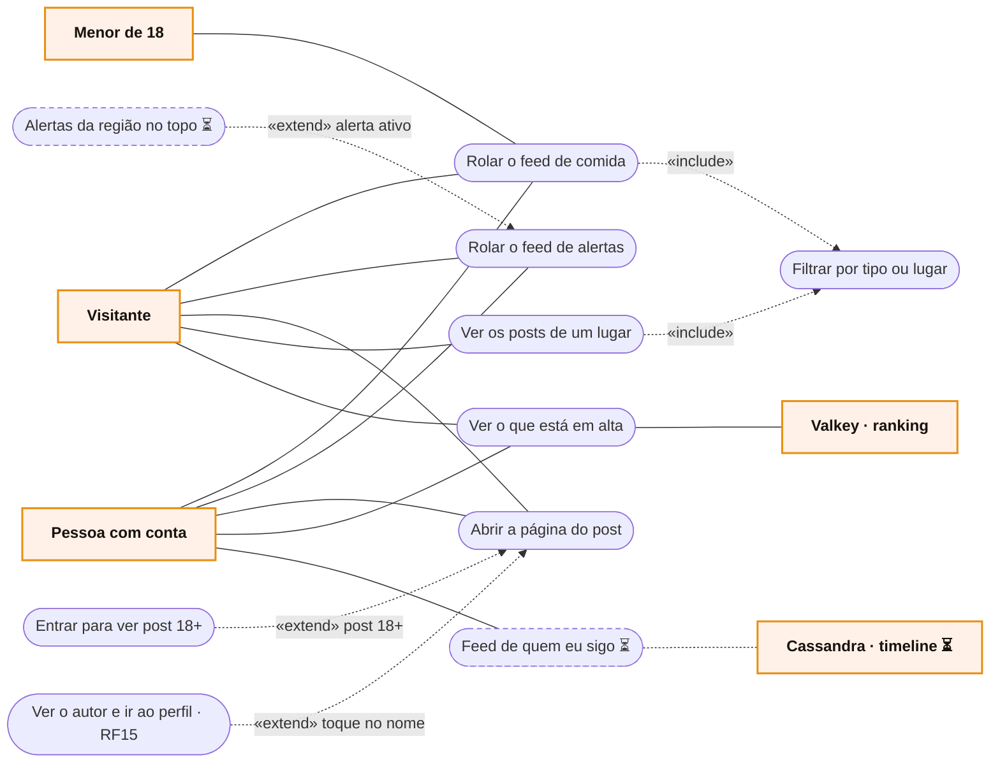

# RF14 · Casos de uso

Atores primários à esquerda, secundários à direita.

```mermaid
flowchart LR
    VIS["Visitante"]:::actor
    PES["Pessoa com conta"]:::actor
    MEN["Menor de 18"]:::actor

    UC1(["Rolar o feed de comida"])
    UC2(["Rolar o feed de alertas"])
    UC3(["Filtrar por tipo ou lugar"])
    UC4(["Abrir a página do post"])
    UC5(["Ver os posts de um lugar"])
    UC6(["Ver o que está em alta"])
    UC7(["Entrar para ver post 18+"])
    UC8(["Ver o autor e ir ao perfil · RF15"])
    UC9(["Feed de quem eu sigo ⏳"]):::planned
    UC10(["Alertas da região no topo ⏳"]):::planned

    VK["Valkey · ranking"]:::actor
    CS["Cassandra · timeline ⏳"]:::actor

    VIS --- UC1 & UC2 & UC4 & UC5 & UC6
    PES --- UC1 & UC2 & UC4 & UC6 & UC9
    MEN --- UC1
    UC1 -. «include» .-> UC3
    UC5 -. «include» .-> UC3
    UC7 -. «extend» post 18+ .-> UC4
    UC8 -. «extend» toque no nome .-> UC4
    UC10 -. «extend» alerta ativo .-> UC2
    UC6 --- VK
    UC9 -.- CS

    classDef actor fill:#FFF1E8,stroke:#E88F12,stroke-width:2px,color:#17120D,font-weight:bold
    classDef planned stroke-dasharray:5 4
```

O menor de 18 vê só posts `LIVRE`: um post 18+ não aparece no feed dele e a página responde `404`.
