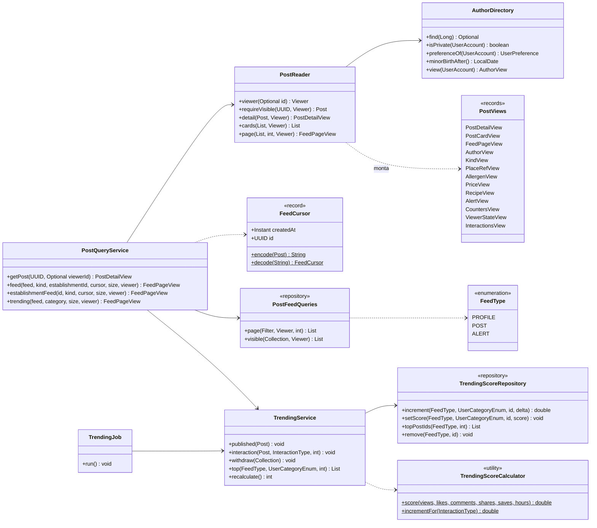

# RF14 · Classes

```mermaid
classDiagram
    direction LR
    class PostQueryService {
        +getPost(UUID, Optional viewerId) PostDetailView
        +feed(feed, kind, establishmentId, cursor, size, viewer) FeedPageView
        +establishmentFeed(id, kind, cursor, size, viewer) FeedPageView
        +trending(feed, category, size, viewer) FeedPageView
    }
    class PostReader {
        +viewer(Optional id) Viewer
        +requireVisible(UUID, Viewer) Post
        +detail(Post, Viewer) PostDetailView
        +cards(List, Viewer) List
        +page(List, int, Viewer) FeedPageView
    }
    class AuthorDirectory {
        +find(Long) Optional
        +isPrivate(UserAccount) boolean
        +preferenceOf(UserAccount) UserPreference
        +minorBirthAfter() LocalDate
        +view(UserAccount) AuthorView
    }
    class FeedCursor {
        <<record>>
        +Instant createdAt
        +UUID id
        +encode(Post)$ String
        +decode(String)$ FeedCursor
    }
    class PostFeedQueries {
        <<repository>>
        +page(Filter, Viewer, int) List
        +visible(Collection, Viewer) List
    }
    class TrendingService {
        +published(Post) void
        +interaction(Post, InteractionType, int) void
        +withdraw(Collection) void
        +top(FeedType, UserCategoryEnum, int) List
        +recalculate() int
    }
    class TrendingJob {
        +run() void
    }
    class TrendingScoreCalculator {
        <<utility>>
        +score(views, likes, comments, shares, saves, hours)$ double
        +incrementFor(InteractionType)$ double
    }
    class TrendingScoreRepository {
        <<repository>>
        +increment(FeedType, UserCategoryEnum, id, delta) double
        +setScore(FeedType, UserCategoryEnum, id, score) void
        +topPostIds(FeedType, int) List
        +remove(FeedType, id) void
    }
    class FeedType {
        <<enumeration>>
        PROFILE
        POST
        ALERT
    }
    class PostViews {
        <<records>>
        PostDetailView
        PostCardView
        FeedPageView
        AuthorView
        KindView
        PlaceRefView
        AllergenView
        PriceView
        RecipeView
        AlertView
        CountersView
        ViewerStateView
        InteractionsView
    }
    PostQueryService --> PostReader
    PostQueryService --> PostFeedQueries
    PostQueryService --> TrendingService
    PostQueryService ..> FeedCursor
    PostReader --> AuthorDirectory
    PostReader ..> PostViews : monta
    TrendingJob --> TrendingService
    TrendingService --> TrendingScoreRepository
    TrendingService ..> TrendingScoreCalculator
    PostFeedQueries ..> FeedType
```
