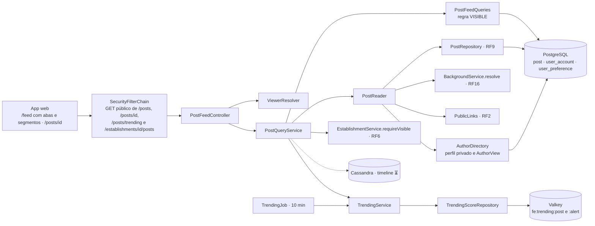

# RF14 · Componentes

```mermaid
flowchart LR
    APP["App web<br/>/feed com abas e segmentos · /posts/id"] --> SEC["SecurityFilterChain<br/>GET público de /posts, /posts/id,<br/>/posts/trending e /establishments/id/posts"]
    SEC --> FC["PostFeedController"]
    FC --> VR["ViewerResolver"]
    FC --> QS["PostQueryService"]
    QS --> RD["PostReader"]
    QS --> FQ["PostFeedQueries<br/>regra VISIBLE"]
    QS --> TS["TrendingService"]
    QS --> ES["EstablishmentService.requireVisible · RF6"]
    RD --> AD["AuthorDirectory<br/>perfil privado e AuthorView"]
    RD --> BS["BackgroundService.resolve · RF16"]
    RD --> PL["PublicLinks · RF2"]
    RD --> PR["PostRepository · RF9"]
    TJ["TrendingJob · 10 min"] --> TS
    TS --> TR["TrendingScoreRepository"]
    FQ & PR & AD --> PG[("PostgreSQL<br/>post · user_account · user_preference")]
    TR --> VK[("Valkey<br/>fe:trending:post e :alert")]
    QS -.-> CS[("Cassandra · timeline ⏳")]
```
