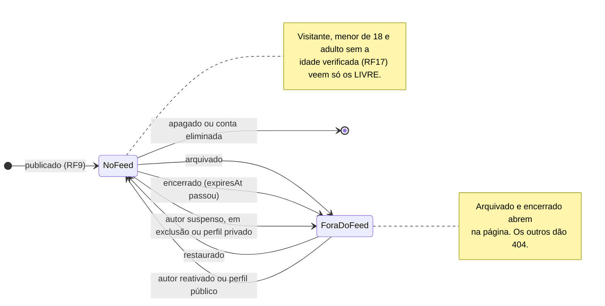
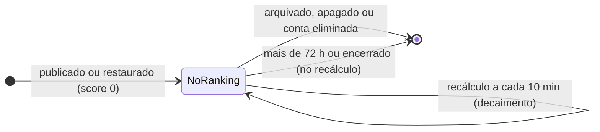

# RF14 · Estados

## O post no feed

```mermaid
stateDiagram-v2
    direction LR
    [*] --> NoFeed : publicado (RF9)
    NoFeed --> ForaDoFeed : arquivado
    ForaDoFeed --> NoFeed : restaurado
    NoFeed --> ForaDoFeed : encerrado (expiresAt passou)
    NoFeed --> ForaDoFeed : autor suspenso, em exclusão ou perfil privado
    ForaDoFeed --> NoFeed : autor reativado ou perfil público
    NoFeed --> [*] : apagado ou conta eliminada
    note right of NoFeed
        Visitante, menor de 18 e adulto sem a
        idade verificada (RF17) veem só os LIVRE.
    end note
    note right of ForaDoFeed
        Arquivado e encerrado abrem
        na página. Os outros dão 404.
    end note
```

## O post no ranking em alta

```mermaid
stateDiagram-v2
    direction LR
    [*] --> NoRanking : publicado ou restaurado (score 0)
    NoRanking --> NoRanking : interação soma ou subtrai o peso
    NoRanking --> NoRanking : recálculo a cada 10 min (decaimento)
    NoRanking --> [*] : arquivado, apagado ou conta eliminada
    NoRanking --> [*] : mais de 72 h ou encerrado (no recálculo)
```
