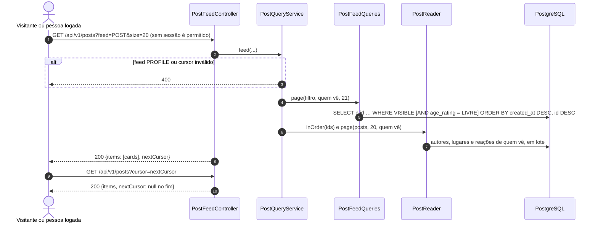
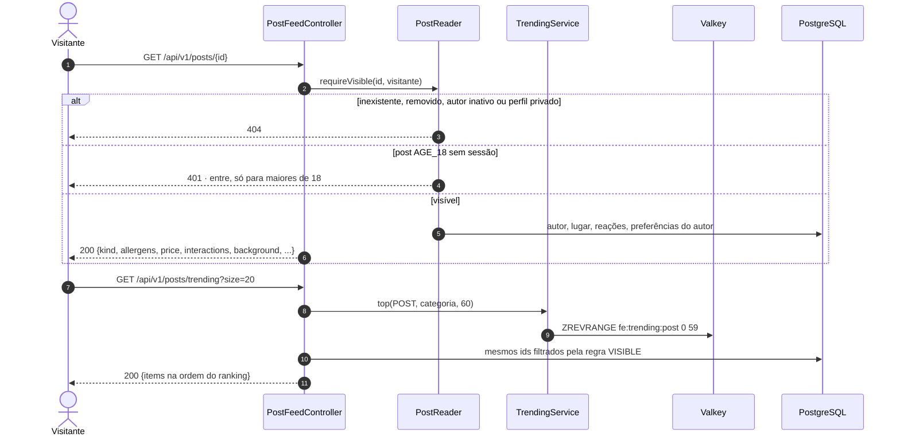

# RF14 · Sequência

## Feed com cursor

```mermaid
sequenceDiagram
    autonumber
    actor V as Visitante ou pessoa logada
    participant API as PostFeedController
    participant Q as PostQueryService
    participant F as PostFeedQueries
    participant R as PostReader
    participant DB as PostgreSQL

    V->>API: GET /api/v1/posts?feed=POST&size=20 (sem sessão é permitido)
    API->>Q: feed(...)
    alt feed PROFILE ou cursor inválido
        Q-->>V: 400
    end
    Q->>F: page(filtro, quem vê, 21)
    F->>DB: SELECT p.id … WHERE VISIBLE [AND age_rating = LIVRE] ORDER BY created_at DESC, id DESC
    Q->>R: inOrder(ids) e page(posts, 20, quem vê)
    R->>DB: autores, lugares e reações de quem vê, em lote
    API-->>V: 200 {items: [cards], nextCursor}
    V->>API: GET /api/v1/posts?cursor=nextCursor
    API-->>V: 200 {items, nextCursor: null no fim}
```

## Página do post 18+ e em alta

```mermaid
sequenceDiagram
    autonumber
    actor V as Visitante
    participant API as PostFeedController
    participant R as PostReader
    participant T as TrendingService
    participant VK as Valkey
    participant DB as PostgreSQL

    V->>API: GET /api/v1/posts/{id}
    API->>R: requireVisible(id, visitante)
    alt inexistente, removido, autor inativo ou perfil privado
        R-->>V: 404
    else post AGE_18 sem sessão
        R-->>V: 401 · entre, só para maiores de 18
    else visível
        R->>DB: autor, lugar, reações, preferências do autor
        API-->>V: 200 {kind, allergens, price, interactions, background, ...}
    end
    V->>API: GET /api/v1/posts/trending?size=20
    API->>T: top(POST, categoria, 60)
    T->>VK: ZREVRANGE fe:trending:post 0 59
    API->>DB: mesmos ids filtrados pela regra VISIBLE
    API-->>V: 200 {items na ordem do ranking}
```
