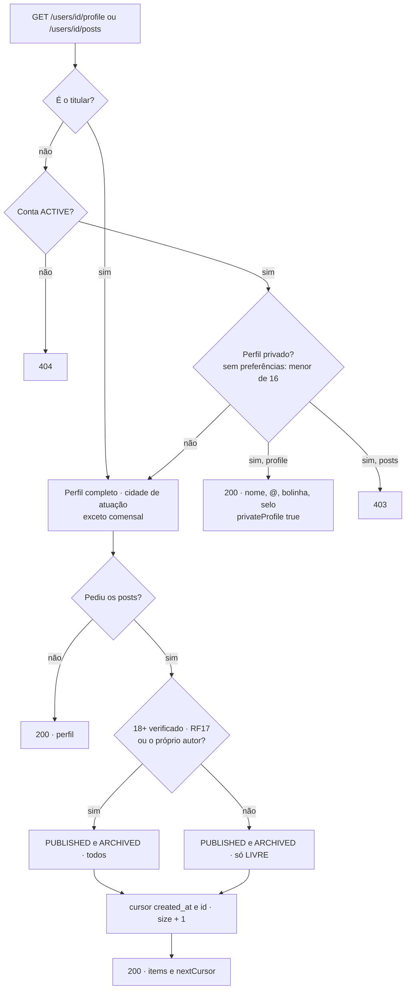
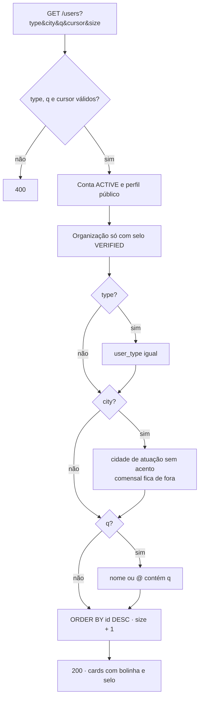

# RF15 · Atividades

## Perfil e posts do autor

```mermaid
flowchart TD
    G[GET /users/id/profile ou /users/id/posts] --> T{É o titular?}
    T -- sim --> FULL
    T -- não --> A{Conta ACTIVE?}
    A -- não --> N404[404]
    A -- sim --> P{Perfil privado?<br/>sem preferências: menor de 16}
    P -- sim, profile --> MIN[200 · nome, @, bolinha, selo<br/>privateProfile true]
    P -- sim, posts --> N403[403]
    P -- não --> FULL[Perfil completo · cidade de atuação<br/>exceto comensal]
    FULL --> PO{Pediu os posts?}
    PO -- não --> OK1[200 · perfil]
    PO -- sim --> AG{18+ verificado · RF17<br/>ou o próprio autor?}
    AG -- sim --> ALL[PUBLISHED e ARCHIVED · todos]
    AG -- não --> LV[PUBLISHED e ARCHIVED · só LIVRE]
    ALL & LV --> PG[cursor created_at e id · size + 1]
    PG --> OK2[200 · items e nextCursor]
```

## Feed de perfis (`GET /api/v1/users`)

```mermaid
flowchart TD
    F[GET /users?type&city&q&cursor&size] --> V{type, q e cursor válidos?}
    V -- não --> E400[400]
    V -- sim --> Q[Conta ACTIVE e perfil público]
    Q --> O[Organização só com selo VERIFIED]
    O --> TY{type?}
    TY -- sim --> FT[user_type igual]
    TY -- não --> CI
    FT --> CI{city?}
    CI -- sim --> FC[cidade de atuação sem acento<br/>comensal fica de fora]
    CI -- não --> QQ
    FC --> QQ{q?}
    QQ -- sim --> FQ[nome ou @ contém q]
    QQ -- não --> ORD
    FQ --> ORD[ORDER BY id DESC · size + 1]
    ORD --> OK[200 · cards com bolinha e selo]
```
