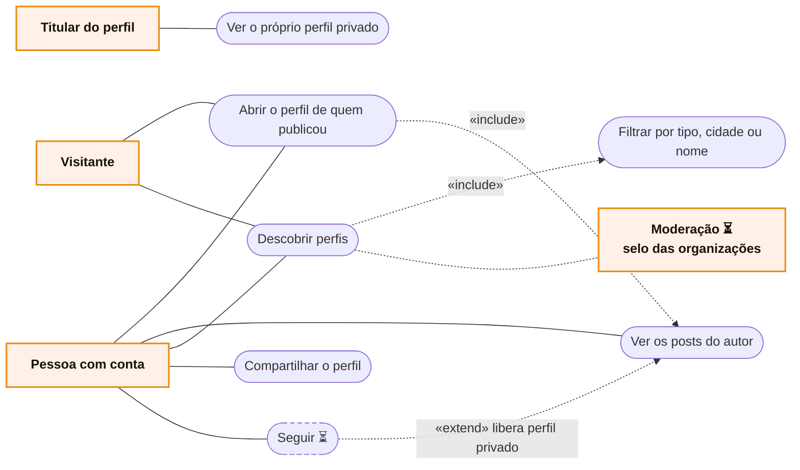

# RF15 · Casos de uso

Atores primários à esquerda, secundários à direita.

```mermaid
flowchart LR
    VIS["Visitante"]:::actor
    PES["Pessoa com conta"]:::actor
    TIT["Titular do perfil"]:::actor

    UC1(["Abrir o perfil de quem publicou"])
    UC2(["Ver os posts do autor"])
    UC3(["Descobrir perfis"])
    UC4(["Filtrar por tipo, cidade ou nome"])
    UC5(["Ver o próprio perfil privado"])
    UC6(["Compartilhar o perfil"])
    UC7(["Seguir ⏳"]):::planned

    MOD["Moderação ⏳<br/>selo das organizações"]:::actor

    VIS --- UC1 & UC3
    PES --- UC1 & UC2 & UC3 & UC6 & UC7
    TIT --- UC5
    UC1 -. «include» .-> UC2
    UC3 -. «include» .-> UC4
    UC7 -. «extend» libera perfil privado .-> UC2
    UC3 -.- MOD

    classDef actor fill:#FFF1E8,stroke:#E88F12,stroke-width:2px,color:#17120D,font-weight:bold
    classDef planned stroke-dasharray:5 4
```

Perfil privado mostra só nome, @, bolinha e selo a quem não é o titular, e os posts dele não abrem (`403`).
