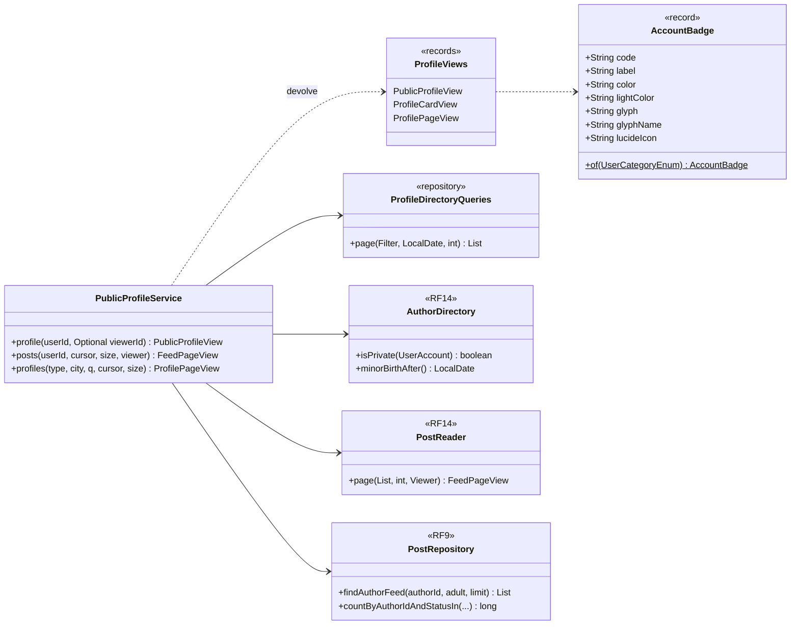

# RF15 · Classes

```mermaid
classDiagram
    direction LR
    class PublicProfileService {
        +profile(userId, Optional viewerId) PublicProfileView
        +posts(userId, cursor, size, viewer) FeedPageView
        +profiles(type, city, q, cursor, size) ProfilePageView
    }
    class AccountBadge {
        <<record>>
        +String code
        +String label
        +String color
        +String lightColor
        +String glyph
        +String glyphName
        +String lucideIcon
        +of(UserCategoryEnum)$ AccountBadge
    }
    class ProfileViews {
        <<records>>
        PublicProfileView
        ProfileCardView
        ProfilePageView
    }
    class ProfileDirectoryQueries {
        <<repository>>
        +page(Filter, LocalDate, int) List
    }
    class AuthorDirectory {
        <<RF14>>
        +isPrivate(UserAccount) boolean
        +minorBirthAfter() LocalDate
    }
    class PostReader {
        <<RF14>>
        +page(List, int, Viewer) FeedPageView
    }
    class PostRepository {
        <<RF9>>
        +findAuthorFeed(authorId, adult, limit) List
        +countByAuthorIdAndStatusIn(...) long
    }
    PublicProfileService --> ProfileDirectoryQueries
    PublicProfileService --> AuthorDirectory
    PublicProfileService --> PostReader
    PublicProfileService --> PostRepository
    PublicProfileService ..> ProfileViews : devolve
    ProfileViews ..> AccountBadge
```
