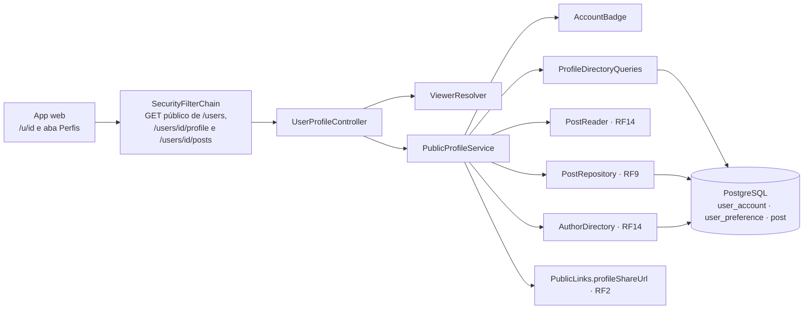

# RF15 · Componentes

```mermaid
flowchart LR
    APP["App web<br/>/u/id e aba Perfis"] --> SEC["SecurityFilterChain<br/>GET público de /users,<br/>/users/id/profile e /users/id/posts"]
    SEC --> UC["UserProfileController"]
    UC --> VR["ViewerResolver"]
    UC --> PS["PublicProfileService"]
    PS --> AB["AccountBadge"]
    PS --> AD["AuthorDirectory · RF14"]
    PS --> RD["PostReader · RF14"]
    PS --> PR["PostRepository · RF9"]
    PS --> DQ["ProfileDirectoryQueries"]
    PS --> PL["PublicLinks.profileShareUrl · RF2"]
    DQ & PR & AD --> PG[("PostgreSQL<br/>user_account · user_preference · post")]
```
