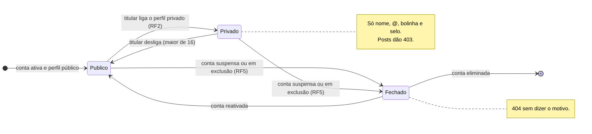
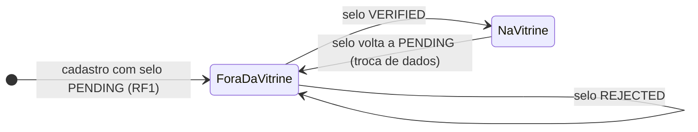

# RF15 · Estados

## Perfil para quem não é o titular

```mermaid
stateDiagram-v2
    direction LR
    [*] --> Publico : conta ativa e perfil público
    Publico --> Privado : titular liga o perfil privado (RF2)
    Privado --> Publico : titular desliga (maior de 16)
    Publico --> Fechado : conta suspensa ou em exclusão (RF5)
    Privado --> Fechado : conta suspensa ou em exclusão (RF5)
    Fechado --> Publico : conta reativada
    Fechado --> [*] : conta eliminada
    note right of Privado
        Só nome, @, bolinha e selo.
        Posts dão 403.
    end note
    note right of Fechado
        404 sem dizer o motivo.
    end note
```

## Organização na vitrine de perfis

```mermaid
stateDiagram-v2
    direction LR
    [*] --> ForaDaVitrine : cadastro com selo PENDING (RF1)
    ForaDaVitrine --> NaVitrine : selo VERIFIED
    NaVitrine --> ForaDaVitrine : selo volta a PENDING (troca de dados)
    ForaDaVitrine --> ForaDaVitrine : selo REJECTED
```
