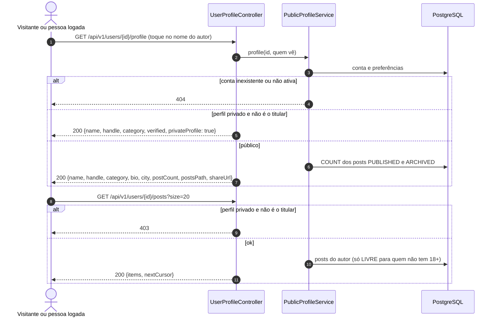
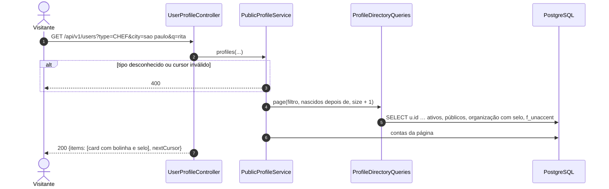

# RF15 · Sequência

## Do card ao perfil

```mermaid
sequenceDiagram
    autonumber
    actor V as Visitante ou pessoa logada
    participant API as UserProfileController
    participant S as PublicProfileService
    participant DB as PostgreSQL

    V->>API: GET /api/v1/users/{id}/profile (toque no nome do autor)
    API->>S: profile(id, quem vê)
    S->>DB: conta e preferências
    alt conta inexistente ou não ativa
        S-->>V: 404
    else perfil privado e não é o titular
        API-->>V: 200 {name, handle, category, verified, privateProfile: true}
    else público
        S->>DB: COUNT dos posts PUBLISHED e ARCHIVED
        API-->>V: 200 {name, handle, category, bio, city, postCount, postsPath, shareUrl}
    end
    V->>API: GET /api/v1/users/{id}/posts?size=20
    alt perfil privado e não é o titular
        API-->>V: 403
    else ok
        S->>DB: posts do autor (só LIVRE para quem não tem 18+)
        API-->>V: 200 {items, nextCursor}
    end
```

## Vitrine de perfis

```mermaid
sequenceDiagram
    autonumber
    actor V as Visitante
    participant API as UserProfileController
    participant S as PublicProfileService
    participant Q as ProfileDirectoryQueries
    participant DB as PostgreSQL

    V->>API: GET /api/v1/users?type=CHEF&city=sao paulo&q=rita
    API->>S: profiles(...)
    alt tipo desconhecido ou cursor inválido
        S-->>V: 400
    end
    S->>Q: page(filtro, nascidos depois de, size + 1)
    Q->>DB: SELECT u.id … ativos, públicos, organização com selo, f_unaccent
    S->>DB: contas da página
    API-->>V: 200 {items: [card com bolinha e selo], nextCursor}
```
