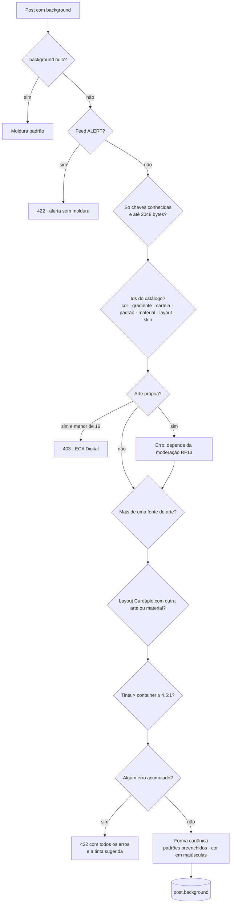
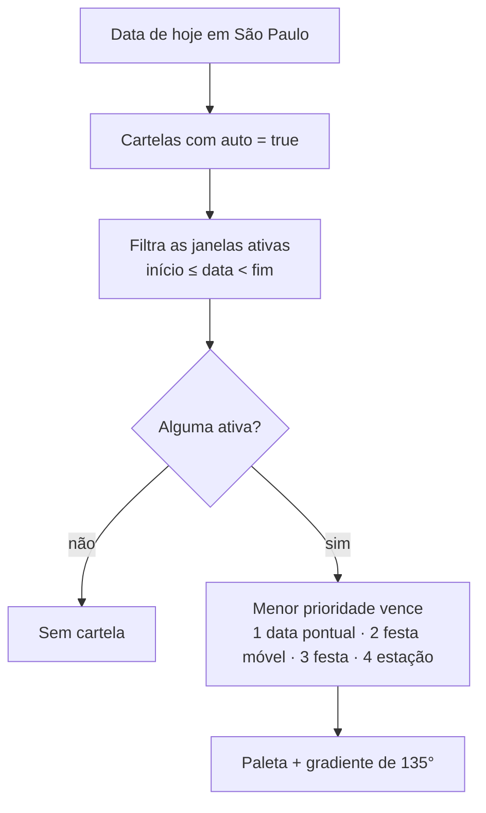

# RF16 · Atividades: validar a moldura do post

```mermaid
flowchart TD
    A["Post com background"] --> N{background nulo?}
    N -- sim --> OK0[Moldura padrão]
    N -- não --> F{Feed ALERT?}
    F -- sim --> E422A[422 · alerta sem moldura]
    F -- não --> K{Só chaves conhecidas<br/>e até 2048 bytes?}
    K --> I{Ids do catálogo?<br/>cor · gradiente · cartela · padrão · material · layout · skin}
    I --> C{Arte própria?}
    C -- "sim e menor de 16" --> E403[403 · ECA Digital]
    C -- "sim" --> P[Erro: depende da moderação RF13]
    C -- não --> U{Mais de uma fonte de arte?}
    P --> U
    U --> L{Layout Cardápio com outra arte ou material?}
    L --> T{Tinta × container ≥ 4,5:1?}
    T --> R{Algum erro acumulado?}
    R -- sim --> E422[422 com todos os erros<br/>e a tinta sugerida]
    R -- não --> CAN[Forma canônica<br/>padrões preenchidos · cor em maiúsculas]
    CAN --> DB[(post.background)]
```

## Atividades: cartela automática

```mermaid
flowchart TD
    D[Data de hoje em São Paulo] --> S[Cartelas com auto = true]
    S --> W[Filtra as janelas ativas<br/>início ≤ data < fim]
    W --> P{Alguma ativa?}
    P -- não --> NONE[Sem cartela]
    P -- sim --> MIN[Menor prioridade vence<br/>1 data pontual · 2 festa móvel · 3 festa · 4 estação]
    MIN --> OUT[Paleta + gradiente de 135°]
```
