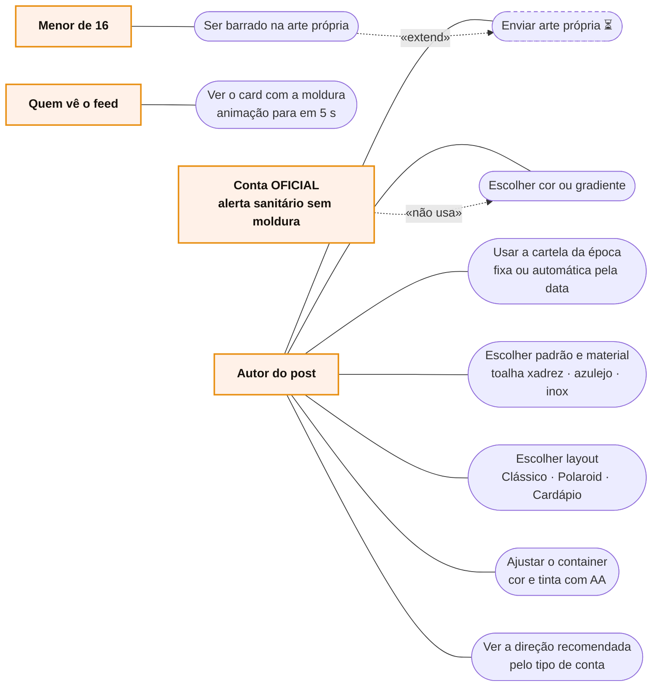

# RF16 · Casos de uso

```mermaid
flowchart LR
    A["Autor do post"]:::actor
    M["Menor de 16"]:::actor
    V["Quem vê o feed"]:::actor

    UC1(["Escolher cor ou gradiente"])
    UC2(["Usar a cartela da época<br/>fixa ou automática pela data"])
    UC3(["Escolher padrão e material<br/>toalha xadrez · azulejo · inox"])
    UC4(["Escolher layout<br/>Clássico · Polaroid · Cardápio"])
    UC5(["Ajustar o container<br/>cor e tinta com AA"])
    UC6(["Ver a direção recomendada<br/>pelo tipo de conta"])
    UC7(["Enviar arte própria ⏳"]):::planned
    UC8(["Ver o card com a moldura<br/>animação para em 5 s"])
    UC9(["Ser barrado na arte própria"])

    OF["Conta OFICIAL<br/>alerta sanitário sem moldura"]:::actor

    A --- UC1 & UC2 & UC3 & UC4 & UC5 & UC6 & UC7
    M --- UC9
    V --- UC8
    UC9 -. «extend» .-> UC7
    OF -. «não usa» .-> UC1

    classDef actor fill:#FFF1E8,stroke:#E88F12,stroke-width:2px,color:#17120D,font-weight:bold
    classDef planned stroke-dasharray:5 4
```
