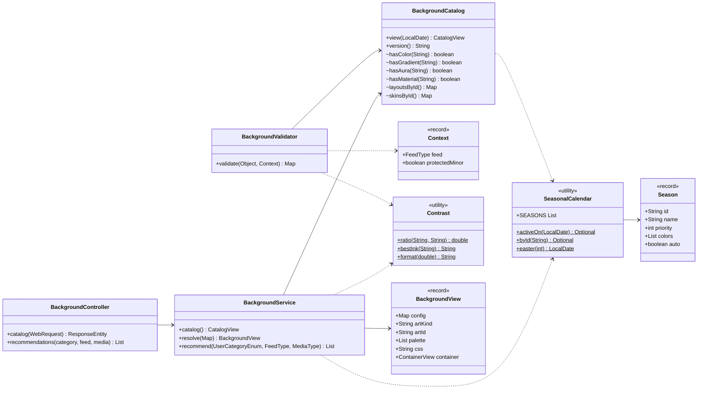

# RF16 · Classes

```mermaid
classDiagram
    direction LR
    class BackgroundCatalog {
        +view(LocalDate) CatalogView
        +version() String
        ~hasColor(String) boolean
        ~hasGradient(String) boolean
        ~hasAura(String) boolean
        ~hasMaterial(String) boolean
        ~layoutsById() Map
        ~skinsById() Map
    }
    class SeasonalCalendar {
        <<utility>>
        +SEASONS List
        +activeOn(LocalDate)$ Optional
        +byId(String)$ Optional
        +easter(int)$ LocalDate
    }
    class Season {
        <<record>>
        +String id
        +String name
        +int priority
        +List colors
        +boolean auto
    }
    class BackgroundValidator {
        +validate(Object, Context) Map
    }
    class Context {
        <<record>>
        +FeedType feed
        +boolean protectedMinor
    }
    class Contrast {
        <<utility>>
        +ratio(String, String)$ double
        +bestInk(String)$ String
        +format(double)$ String
    }
    class BackgroundService {
        +catalog() CatalogView
        +resolve(Map) BackgroundView
        +recommend(UserCategoryEnum, FeedType, MediaType) List
    }
    class BackgroundView {
        <<record>>
        +Map config
        +String artKind
        +String artId
        +List palette
        +String css
        +ContainerView container
    }
    class BackgroundController {
        +catalog(WebRequest) ResponseEntity
        +recommendations(category, feed, media) List
    }
    SeasonalCalendar --> Season
    BackgroundCatalog ..> SeasonalCalendar
    BackgroundValidator --> BackgroundCatalog
    BackgroundValidator ..> Contrast
    BackgroundValidator ..> Context
    BackgroundService --> BackgroundCatalog
    BackgroundService ..> SeasonalCalendar
    BackgroundService ..> Contrast
    BackgroundService --> BackgroundView
    BackgroundController --> BackgroundService
```
