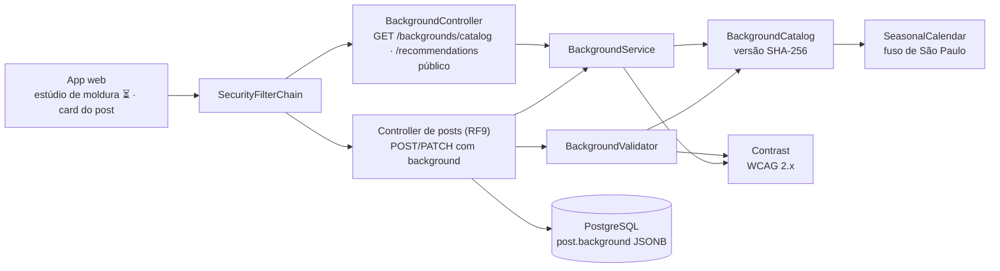

# RF16 · Componentes

```mermaid
flowchart LR
    APP["App web<br/>estúdio de moldura ⏳ · card do post"] --> SEC["SecurityFilterChain"]
    SEC --> BC["BackgroundController<br/>GET /backgrounds/catalog · /recommendations<br/>público"]
    SEC --> PC["Controller de posts (RF9)<br/>POST/PATCH com background"]
    BC --> BS["BackgroundService"]
    PC --> BV["BackgroundValidator"]
    PC --> BS
    BS --> CAT["BackgroundCatalog<br/>versão SHA-256"]
    BV --> CAT
    CAT --> SC["SeasonalCalendar<br/>fuso de São Paulo"]
    BV --> CT["Contrast<br/>WCAG 2.x"]
    BS --> CT
    PC --> PG[("PostgreSQL<br/>post.background JSONB")]
```
