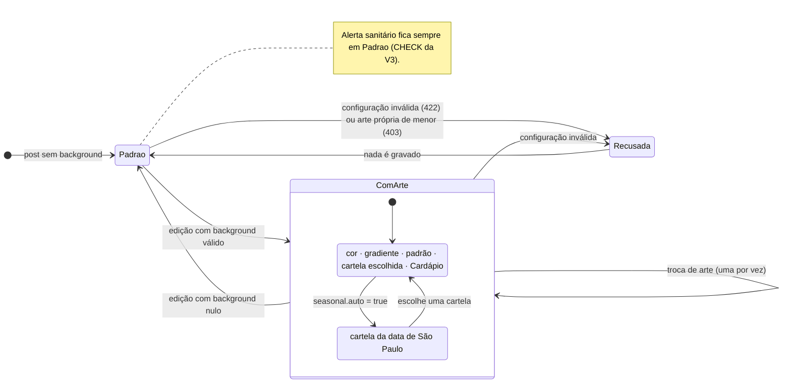

# RF16 · Estados da moldura de um post

```mermaid
stateDiagram-v2
    direction LR
    [*] --> Padrao : post sem background
    Padrao --> ComArte : edição com background válido
    ComArte --> ComArte : troca de arte (uma por vez)
    ComArte --> Padrao : edição com background nulo
    Padrao --> Recusada : configuração inválida (422) ou arte própria de menor (403)
    ComArte --> Recusada : configuração inválida
    Recusada --> Padrao : nada é gravado
    state ComArte {
        [*] --> Fixa
        Fixa : cor · gradiente · padrão · cartela escolhida · Cardápio
        Automatica : cartela da data de São Paulo
        Fixa --> Automatica : seasonal.auto = true
        Automatica --> Fixa : escolhe uma cartela
    }
    note right of Padrao
        Alerta sanitário fica sempre em Padrao (CHECK da V3).
    end note
```
