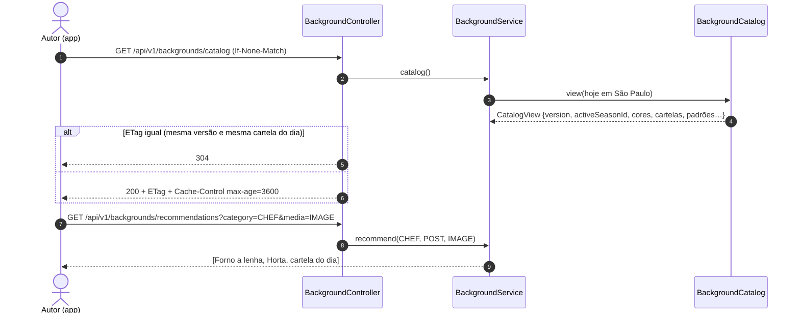
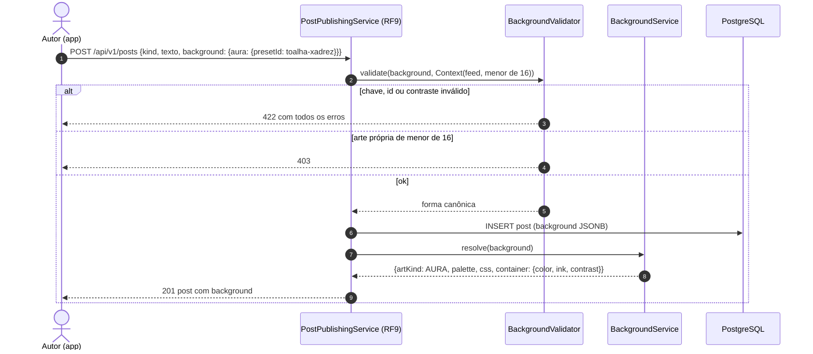

# RF16 · Sequência

## Abrir o estúdio

```mermaid
sequenceDiagram
    autonumber
    actor A as Autor (app)
    participant API as BackgroundController
    participant S as BackgroundService
    participant C as BackgroundCatalog

    A->>API: GET /api/v1/backgrounds/catalog (If-None-Match)
    API->>S: catalog()
    S->>C: view(hoje em São Paulo)
    C-->>S: CatalogView {version, activeSeasonId, cores, cartelas, padrões…}
    alt ETag igual (mesma versão e mesma cartela do dia)
        API-->>A: 304
    else
        API-->>A: 200 + ETag + Cache-Control max-age=3600
    end
    A->>API: GET /api/v1/backgrounds/recommendations?category=CHEF&media=IMAGE
    API->>S: recommend(CHEF, POST, IMAGE)
    S-->>A: [Forno a lenha, Horta, cartela do dia]
```

## Publicar com moldura

```mermaid
sequenceDiagram
    autonumber
    actor A as Autor (app)
    participant P as PostPublishingService (RF9)
    participant V as BackgroundValidator
    participant S as BackgroundService
    participant DB as PostgreSQL

    A->>P: POST /api/v1/posts {kind, texto, background: {aura: {presetId: toalha-xadrez}}}
    P->>V: validate(background, Context(feed, menor de 16))
    alt chave, id ou contraste inválido
        V-->>A: 422 com todos os erros
    else arte própria de menor de 16
        V-->>A: 403
    else ok
        V-->>P: forma canônica
        P->>DB: INSERT post (background JSONB)
        P->>S: resolve(background)
        S-->>P: {artKind: AURA, palette, css, container: {color, ink, contrast}}
        P-->>A: 201 post com background
    end
```
