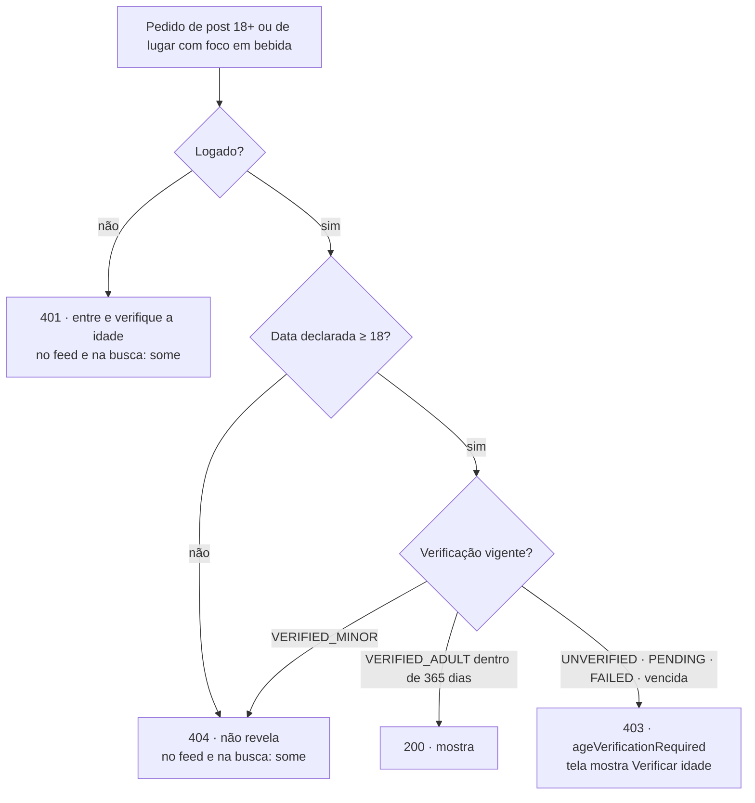
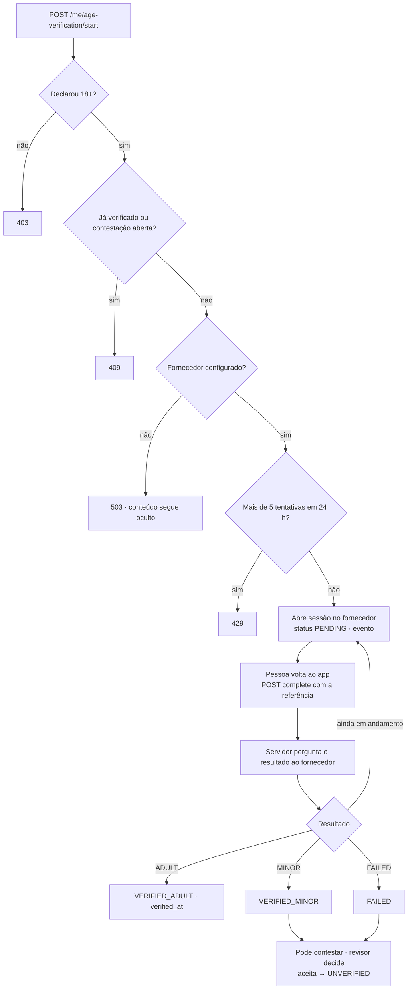
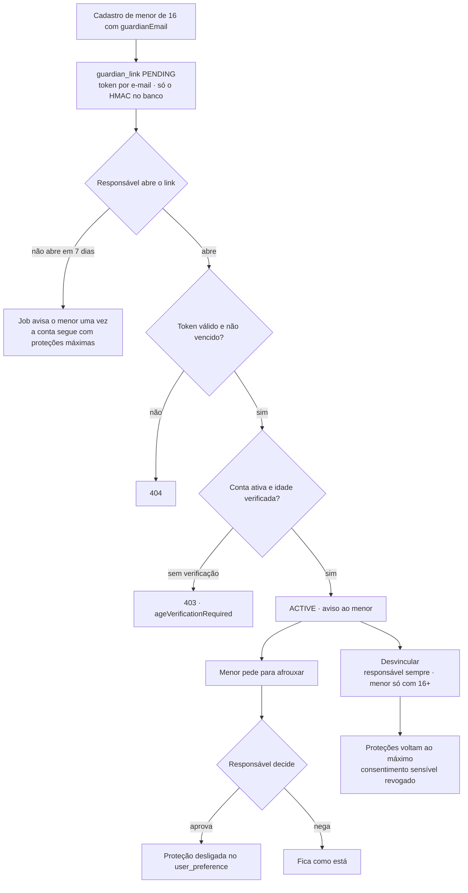

# RF17 · Atividades: quem vê conteúdo de bebida (AgeGate)

```mermaid
flowchart TD
    A["Pedido de post 18+ ou de lugar com foco em bebida"] --> L{"Logado?"}
    L -- "não" --> E401["401 · entre e verifique a idade<br/>no feed e na busca: some"]
    L -- "sim" --> D{"Data declarada ≥ 18?"}
    D -- "não" --> E404["404 · não revela<br/>no feed e na busca: some"]
    D -- "sim" --> S{"Verificação vigente?"}
    S -- "VERIFIED_ADULT dentro de 365 dias" --> OK["200 · mostra"]
    S -- "VERIFIED_MINOR" --> E404
    S -- "UNVERIFIED · PENDING · FAILED · vencida" --> E403["403 · ageVerificationRequired<br/>tela mostra Verificar idade"]
```

## Atividades: verificar a idade

```mermaid
flowchart TD
    S["POST /me/age-verification/start"] --> M{"Declarou 18+?"}
    M -- "não" --> F403["403"]
    M -- "sim" --> V{"Já verificado ou contestação aberta?"}
    V -- "sim" --> F409["409"]
    V -- "não" --> P{"Fornecedor configurado?"}
    P -- "não" --> F503["503 · conteúdo segue oculto"]
    P -- "sim" --> R{"Mais de 5 tentativas em 24 h?"}
    R -- "sim" --> F429["429"]
    R -- "não" --> O["Abre sessão no fornecedor<br/>status PENDING · evento"]
    O --> B["Pessoa volta ao app<br/>POST complete com a referência"]
    B --> Q["Servidor pergunta o resultado ao fornecedor"]
    Q --> X{"Resultado"}
    X -- "ainda em andamento" --> O
    X -- "ADULT" --> VA["VERIFIED_ADULT · verified_at"]
    X -- "MINOR" --> VM["VERIFIED_MINOR"]
    X -- "FAILED" --> FA["FAILED"]
    VM & FA --> C["Pode contestar · revisor decide<br/>aceita → UNVERIFIED"]
```

## Atividades: vínculo com o responsável

```mermaid
flowchart TD
    C["Cadastro de menor de 16 com guardianEmail"] --> I["guardian_link PENDING<br/>token por e-mail · só o HMAC no banco"]
    I --> W{"Responsável abre o link"}
    W -- "não abre em 7 dias" --> AV["Job avisa o menor uma vez<br/>a conta segue com proteções máximas"]
    W -- "abre" --> T{"Token válido e não vencido?"}
    T -- "não" --> N404["404"]
    T -- "sim" --> G{"Conta ativa e idade verificada?"}
    G -- "sem verificação" --> N403["403 · ageVerificationRequired"]
    G -- "sim" --> AC["ACTIVE · aviso ao menor"]
    AC --> RQ["Menor pede para afrouxar"]
    RQ --> DE{"Responsável decide"}
    DE -- "aprova" --> AP["Proteção desligada no user_preference"]
    DE -- "nega" --> NG["Fica como está"]
    AC --> UL["Desvincular<br/>responsável sempre · menor só com 16+"]
    UL --> RE["Proteções voltam ao máximo<br/>consentimento sensível revogado"]
```
