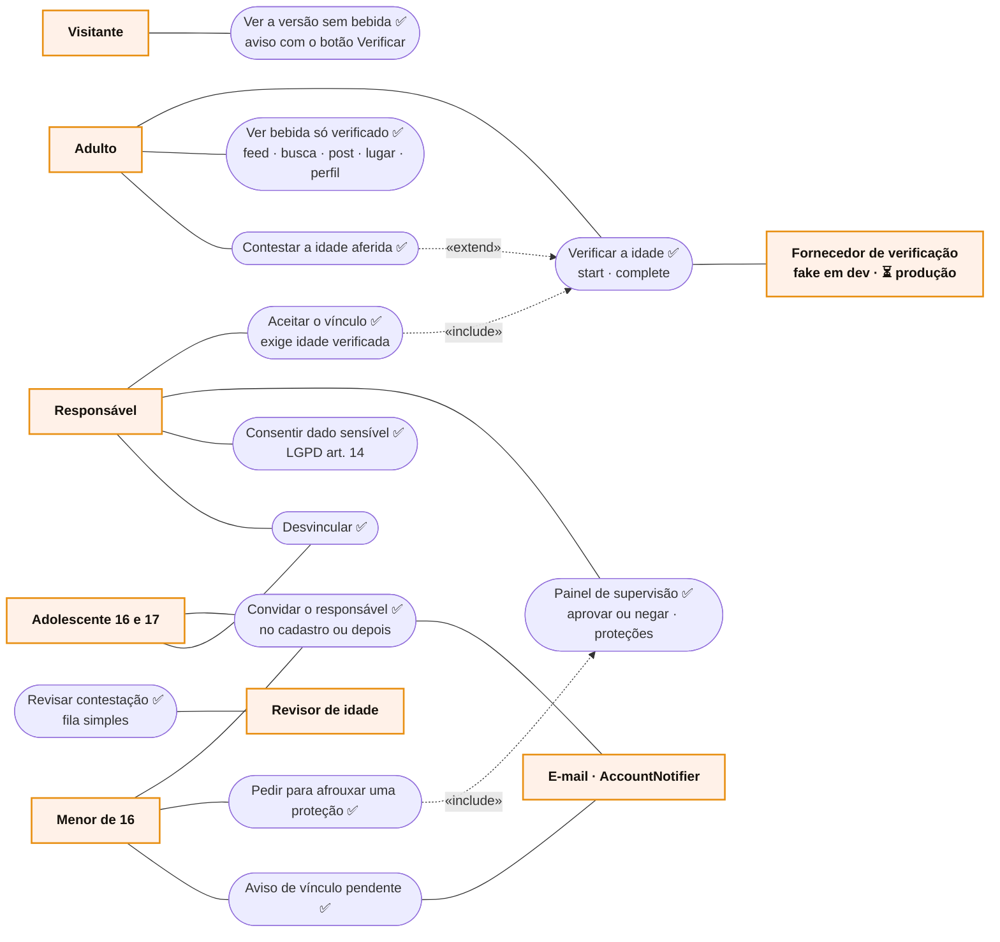

# RF17 · Casos de uso

```mermaid
flowchart LR
    AD["Adulto"]:::actor
    V["Visitante"]:::actor
    MN["Menor de 16"]:::actor
    AO["Adolescente 16 e 17"]:::actor
    RS["Responsável"]:::actor

    UC1(["Verificar a idade ✅<br/>start · complete"])
    UC2(["Ver bebida só verificado ✅<br/>feed · busca · post · lugar · perfil"])
    UC3(["Ver a versão sem bebida ✅<br/>aviso com o botão Verificar"])
    UC4(["Contestar a idade aferida ✅"])
    UC5(["Revisar contestação ✅<br/>fila simples"])
    UC6(["Convidar o responsável ✅<br/>no cadastro ou depois"])
    UC7(["Pedir para afrouxar uma proteção ✅"])
    UC8(["Aceitar o vínculo ✅<br/>exige idade verificada"])
    UC9(["Painel de supervisão ✅<br/>aprovar ou negar · proteções"])
    UC10(["Consentir dado sensível ✅<br/>LGPD art. 14"])
    UC11(["Desvincular ✅"])
    UC12(["Aviso de vínculo pendente ✅"])

    FV["Fornecedor de verificação<br/>fake em dev · ⏳ produção"]:::actor
    RV["Revisor de idade"]:::actor
    EM["E-mail · AccountNotifier"]:::actor

    AD --- UC1 & UC2 & UC4
    V --- UC3
    MN --- UC6 & UC7 & UC12
    AO --- UC6 & UC11
    RS --- UC8 & UC9 & UC10 & UC11
    UC1 --- FV
    UC5 --- RV
    UC6 --- EM
    UC12 --- EM
    UC8 -. «include» .-> UC1
    UC4 -. «extend» .-> UC1
    UC7 -. «include» .-> UC9

    classDef actor fill:#FFF1E8,stroke:#E88F12,stroke-width:2px,color:#17120D,font-weight:bold
    classDef planned stroke-dasharray:5 4
```
