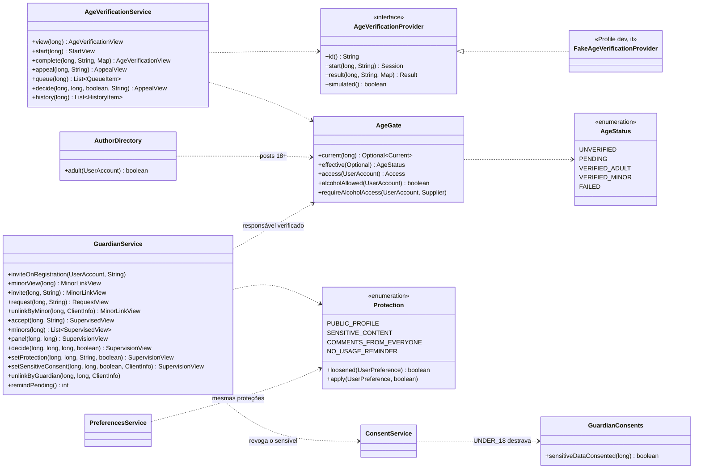

# RF17 · Classes

```mermaid
classDiagram
    direction LR
    class AgeVerificationProvider {
        <<interface>>
        +id() String
        +start(long, String) Session
        +result(long, String, Map) Result
        +simulated() boolean
    }
    class FakeAgeVerificationProvider {
        <<Profile dev, it>>
    }
    class AgeStatus {
        <<enumeration>>
        UNVERIFIED
        PENDING
        VERIFIED_ADULT
        VERIFIED_MINOR
        FAILED
    }
    class AgeGate {
        +current(long) Optional~Current~
        +effective(Optional) AgeStatus
        +access(UserAccount) Access
        +alcoholAllowed(UserAccount) boolean
        +requireAlcoholAccess(UserAccount, Supplier)
    }
    class AgeVerificationService {
        +view(long) AgeVerificationView
        +start(long) StartView
        +complete(long, String, Map) AgeVerificationView
        +appeal(long, String) AppealView
        +queue(long) List~QueueItem~
        +decide(long, long, boolean, String) AppealView
        +history(long) List~HistoryItem~
    }
    class Protection {
        <<enumeration>>
        PUBLIC_PROFILE
        SENSITIVE_CONTENT
        COMMENTS_FROM_EVERYONE
        NO_USAGE_REMINDER
        +loosened(UserPreference) boolean
        +apply(UserPreference, boolean)
    }
    class GuardianService {
        +inviteOnRegistration(UserAccount, String)
        +minorView(long) MinorLinkView
        +invite(long, String) MinorLinkView
        +request(long, String) RequestView
        +unlinkByMinor(long, ClientInfo) MinorLinkView
        +accept(long, String) SupervisedView
        +minors(long) List~SupervisedView~
        +panel(long, long) SupervisionView
        +decide(long, long, long, boolean) SupervisionView
        +setProtection(long, long, String, boolean) SupervisionView
        +setSensitiveConsent(long, long, boolean, ClientInfo) SupervisionView
        +unlinkByGuardian(long, long, ClientInfo)
        +remindPending() int
    }
    class GuardianConsents {
        +sensitiveDataConsented(long) boolean
    }
    class AuthorDirectory {
        +adult(UserAccount) boolean
    }
    class ConsentService
    class PreferencesService
    AgeVerificationProvider <|.. FakeAgeVerificationProvider
    AgeVerificationService ..> AgeVerificationProvider
    AgeVerificationService ..> AgeGate
    AgeGate ..> AgeStatus
    AuthorDirectory ..> AgeGate : posts 18+
    GuardianService ..> AgeGate : responsável verificado
    GuardianService ..> Protection
    GuardianService ..> ConsentService : revoga o sensível
    ConsentService ..> GuardianConsents : UNDER_18 destrava
    PreferencesService ..> Protection : mesmas proteções
```
