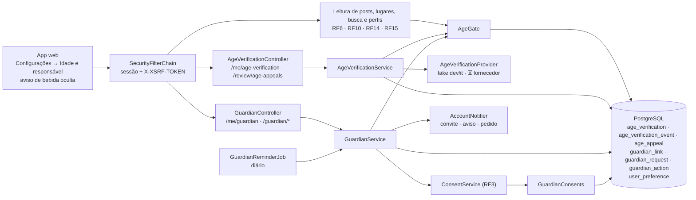

# RF17 · Componentes

```mermaid
flowchart LR
    APP["App web<br/>Configurações → Idade e responsável<br/>aviso de bebida oculta"] --> SEC["SecurityFilterChain<br/>sessão + X-XSRF-TOKEN"]
    SEC --> AVC["AgeVerificationController<br/>/me/age-verification · /review/age-appeals"]
    SEC --> GC["GuardianController<br/>/me/guardian · /guardian/*"]
    SEC --> RD["Leitura de posts, lugares, busca e perfis<br/>RF6 · RF10 · RF14 · RF15"]
    AVC --> AVS["AgeVerificationService"]
    GC --> GS["GuardianService"]
    RD --> AG["AgeGate"]
    AVS --> AG
    GS --> AG
    AVS --> PRV["AgeVerificationProvider<br/>fake dev/it · ⏳ fornecedor"]
    GS --> CS["ConsentService (RF3)"]
    CS --> GCO["GuardianConsents"]
    GS --> NT["AccountNotifier<br/>convite · aviso · pedido"]
    JOB["GuardianReminderJob<br/>diário"] --> GS
    AG --> PG[("PostgreSQL<br/>age_verification · age_verification_event · age_appeal<br/>guardian_link · guardian_request · guardian_action<br/>user_preference")]
    AVS --> PG
    GS --> PG
    GCO --> PG
```
