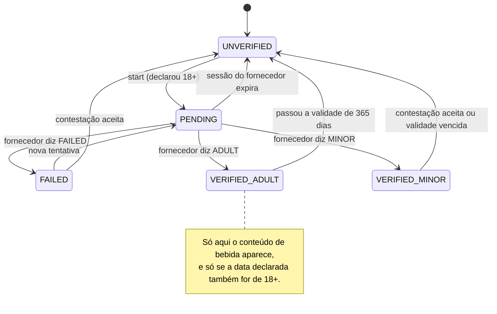
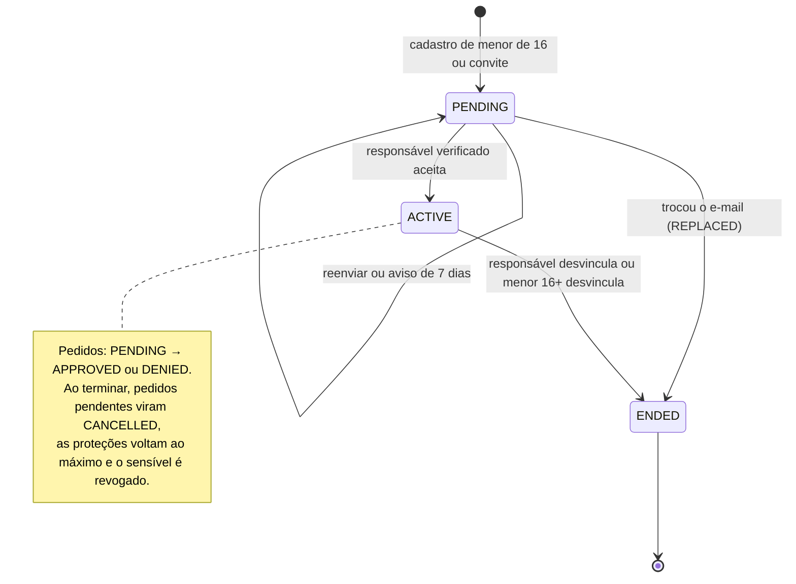

# RF17 · Estados

## Verificação de idade

```mermaid
stateDiagram-v2
    [*] --> UNVERIFIED
    UNVERIFIED --> PENDING : start (declarou 18+)
    FAILED --> PENDING : nova tentativa
    PENDING --> UNVERIFIED : sessão do fornecedor expira
    PENDING --> VERIFIED_ADULT : fornecedor diz ADULT
    PENDING --> VERIFIED_MINOR : fornecedor diz MINOR
    PENDING --> FAILED : fornecedor diz FAILED
    VERIFIED_ADULT --> UNVERIFIED : passou a validade de 365 dias
    VERIFIED_MINOR --> UNVERIFIED : contestação aceita ou validade vencida
    FAILED --> UNVERIFIED : contestação aceita
    note right of VERIFIED_ADULT
        Só aqui o conteúdo de bebida aparece,
        e só se a data declarada também for de 18+.
    end note
```

## Vínculo com o responsável

```mermaid
stateDiagram-v2
    [*] --> PENDING : cadastro de menor de 16 ou convite
    PENDING --> PENDING : reenviar ou aviso de 7 dias
    PENDING --> ENDED : trocou o e-mail (REPLACED)
    PENDING --> ACTIVE : responsável verificado aceita
    ACTIVE --> ENDED : responsável desvincula ou menor 16+ desvincula
    ENDED --> [*]
    note right of ACTIVE
        Pedidos: PENDING → APPROVED ou DENIED.
        Ao terminar, pedidos pendentes viram CANCELLED,
        as proteções voltam ao máximo e o sensível é revogado.
    end note
```
