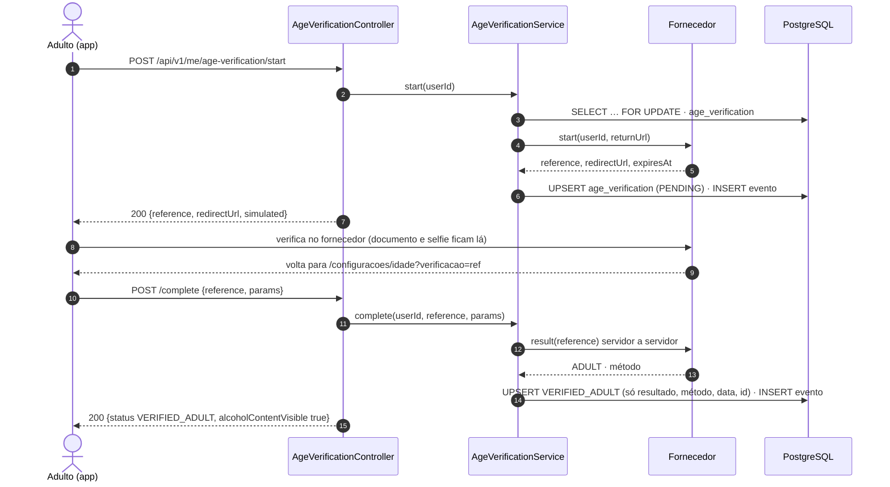
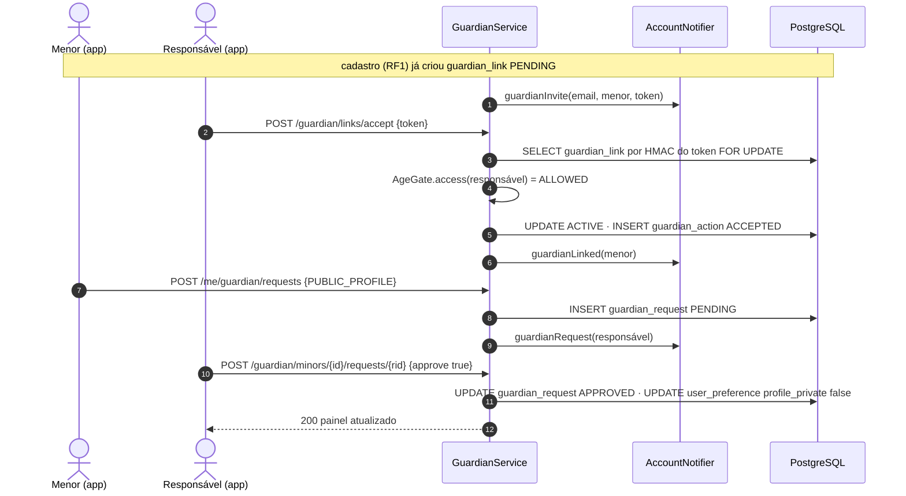

# RF17 · Sequência

## Verificar a idade

```mermaid
sequenceDiagram
    autonumber
    actor A as Adulto (app)
    participant API as AgeVerificationController
    participant S as AgeVerificationService
    participant F as Fornecedor
    participant DB as PostgreSQL

    A->>API: POST /api/v1/me/age-verification/start
    API->>S: start(userId)
    S->>DB: SELECT … FOR UPDATE · age_verification
    S->>F: start(userId, returnUrl)
    F-->>S: reference, redirectUrl, expiresAt
    S->>DB: UPSERT age_verification (PENDING) · INSERT evento
    API-->>A: 200 {reference, redirectUrl, simulated}
    A->>F: verifica no fornecedor (documento e selfie ficam lá)
    F-->>A: volta para /configuracoes/idade?verificacao=ref
    A->>API: POST /complete {reference, params}
    API->>S: complete(userId, reference, params)
    S->>F: result(reference) servidor a servidor
    F-->>S: ADULT · método
    S->>DB: UPSERT VERIFIED_ADULT (só resultado, método, data, id) · INSERT evento
    API-->>A: 200 {status VERIFIED_ADULT, alcoholContentVisible true}
```

## Responsável aceita e aprova um pedido

```mermaid
sequenceDiagram
    autonumber
    actor M as Menor (app)
    actor R as Responsável (app)
    participant G as GuardianService
    participant N as AccountNotifier
    participant DB as PostgreSQL

    Note over M,DB: cadastro (RF1) já criou guardian_link PENDING
    G->>N: guardianInvite(email, menor, token)
    R->>G: POST /guardian/links/accept {token}
    G->>DB: SELECT guardian_link por HMAC do token FOR UPDATE
    G->>G: AgeGate.access(responsável) = ALLOWED
    G->>DB: UPDATE ACTIVE · INSERT guardian_action ACCEPTED
    G->>N: guardianLinked(menor)
    M->>G: POST /me/guardian/requests {PUBLIC_PROFILE}
    G->>DB: INSERT guardian_request PENDING
    G->>N: guardianRequest(responsável)
    R->>G: POST /guardian/minors/{id}/requests/{rid} {approve true}
    G->>DB: UPDATE guardian_request APPROVED · UPDATE user_preference profile_private false
    G-->>R: 200 painel atualizado
```
