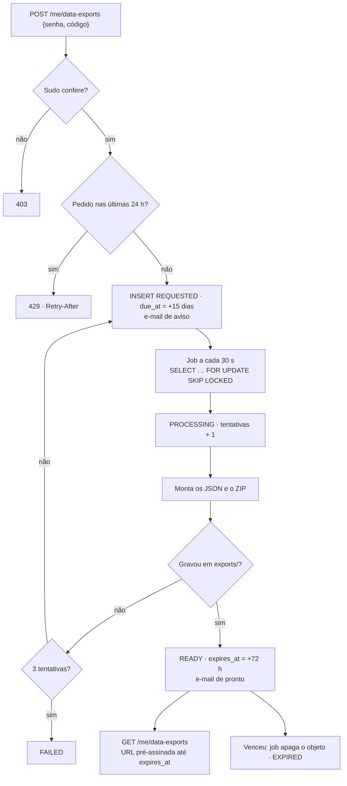
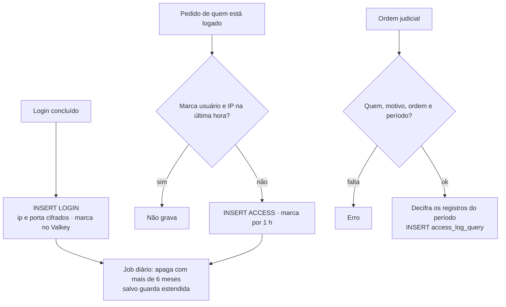

# RF18 · Atividades: exportar meus dados

```mermaid
flowchart TD
    A["POST /me/data-exports {senha, código}"] --> S{"Sudo confere?"}
    S -- "não" --> E403["403"]
    S -- "sim" --> D{"Pedido nas últimas 24 h?"}
    D -- "sim" --> E429["429 · Retry-After"]
    D -- "não" --> R["INSERT REQUESTED · due_at = +15 dias<br/>e-mail de aviso"]
    R --> J["Job a cada 30 s<br/>SELECT … FOR UPDATE SKIP LOCKED"]
    J --> P["PROCESSING · tentativas + 1"]
    P --> B["Monta os JSON e o ZIP"]
    B --> W{"Gravou em exports/?"}
    W -- "não" --> F{"3 tentativas?"}
    F -- "não" --> R
    F -- "sim" --> FA["FAILED"]
    W -- "sim" --> OK["READY · expires_at = +72 h<br/>e-mail de pronto"]
    OK --> G["GET /me/data-exports<br/>URL pré-assinada até expires_at"]
    OK --> X["Venceu: job apaga o objeto · EXPIRED"]
```

## Atividades: registro de acesso (Marco Civil)

```mermaid
flowchart TD
    L["Login concluído"] --> LG["INSERT LOGIN<br/>ip e porta cifrados · marca no Valkey"]
    Q["Pedido de quem está logado"] --> K{"Marca usuário e IP na última hora?"}
    K -- "sim" --> N["Não grava"]
    K -- "não" --> AC["INSERT ACCESS · marca por 1 h"]
    LG & AC --> RT["Job diário: apaga com mais de 6 meses<br/>salvo guarda estendida"]
    O["Ordem judicial"] --> C{"Quem, motivo, ordem e período?"}
    C -- "falta" --> E["Erro"]
    C -- "ok" --> D["Decifra os registros do período<br/>INSERT access_log_query"]
```
