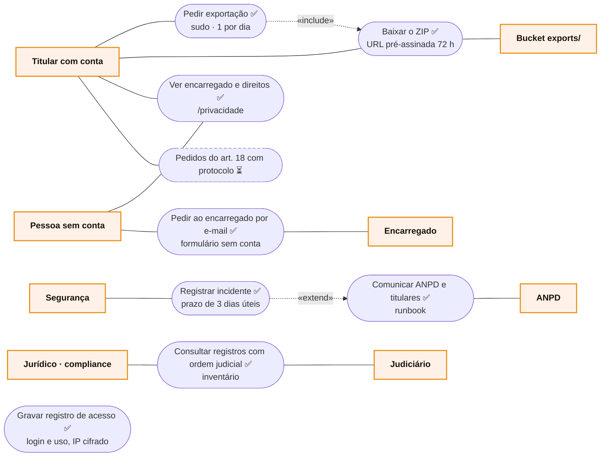

# RF18 · Casos de uso

```mermaid
flowchart LR
    T["Titular com conta"]:::actor
    NU["Pessoa sem conta"]:::actor
    JU["Jurídico · compliance"]:::actor
    SG["Segurança"]:::actor

    UC1(["Pedir exportação ✅<br/>sudo · 1 por dia"])
    UC2(["Baixar o ZIP ✅<br/>URL pré-assinada 72 h"])
    UC3(["Ver encarregado e direitos ✅<br/>/privacidade"])
    UC4(["Pedir ao encarregado por e-mail ✅<br/>formulário sem conta"])
    UC5(["Gravar registro de acesso ✅<br/>login e uso, IP cifrado"])
    UC6(["Consultar registros com ordem judicial ✅<br/>inventário"])
    UC7(["Registrar incidente ✅<br/>prazo de 3 dias úteis"])
    UC8(["Comunicar ANPD e titulares ✅<br/>runbook"])
    UC9(["Pedidos do art. 18 com protocolo ⏳"]):::planned

    DPO["Encarregado"]:::actor
    ANPD["ANPD"]:::actor
    JUD["Judiciário"]:::actor
    S3["Bucket exports/"]:::actor

    T --- UC1 & UC2 & UC3 & UC9
    NU --- UC3 & UC4
    JU --- UC6
    SG --- UC7
    UC4 --- DPO
    UC8 --- ANPD
    UC6 --- JUD
    UC2 --- S3
    UC7 -. «extend» .-> UC8
    UC1 -. «include» .-> UC2

    classDef actor fill:#FFF1E8,stroke:#E88F12,stroke-width:2px,color:#17120D,font-weight:bold
    classDef planned stroke-dasharray:5 4
```
