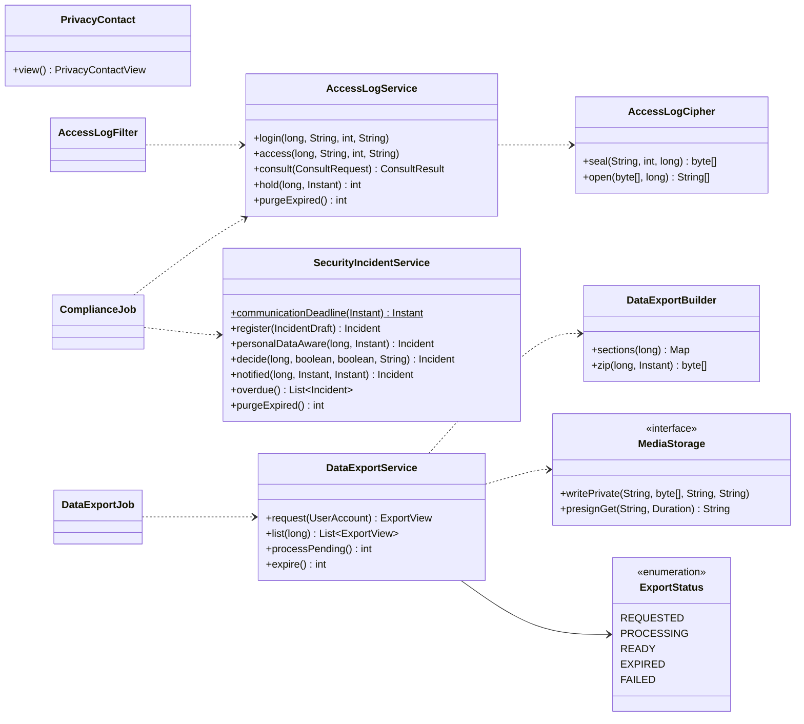

# RF18 · Classes

```mermaid
classDiagram
    direction LR
    class PrivacyContact {
        +view() PrivacyContactView
    }
    class DataExportService {
        +request(UserAccount) ExportView
        +list(long) List~ExportView~
        +processPending() int
        +expire() int
    }
    class DataExportBuilder {
        +sections(long) Map
        +zip(long, Instant) byte[]
    }
    class MediaStorage {
        <<interface>>
        +writePrivate(String, byte[], String, String)
        +presignGet(String, Duration) String
    }
    class AccessLogService {
        +login(long, String, int, String)
        +access(long, String, int, String)
        +consult(ConsultRequest) ConsultResult
        +hold(long, Instant) int
        +purgeExpired() int
    }
    class AccessLogCipher {
        +seal(String, int, long) byte[]
        +open(byte[], long) String[]
    }
    class AccessLogFilter
    class SecurityIncidentService {
        +communicationDeadline(Instant)$ Instant
        +register(IncidentDraft) Incident
        +personalDataAware(long, Instant) Incident
        +decide(long, boolean, boolean, String) Incident
        +notified(long, Instant, Instant) Incident
        +overdue() List~Incident~
        +purgeExpired() int
    }
    class ExportStatus {
        <<enumeration>>
        REQUESTED
        PROCESSING
        READY
        EXPIRED
        FAILED
    }
    class DataExportJob
    class ComplianceJob
    DataExportService ..> DataExportBuilder
    DataExportService ..> MediaStorage
    DataExportService --> ExportStatus
    DataExportJob ..> DataExportService
    ComplianceJob ..> AccessLogService
    ComplianceJob ..> SecurityIncidentService
    AccessLogFilter ..> AccessLogService
    AccessLogService ..> AccessLogCipher
```
